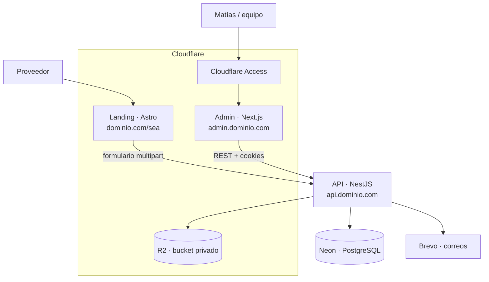
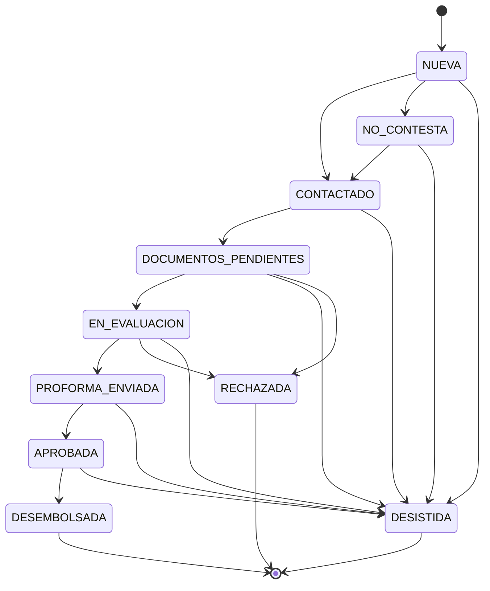

# Anticipate Factoring · Stack y arquitectura

> Documento vivo. Registra qué usamos, cómo se conecta y por qué lo elegimos.
> Cuando cambie una decisión, se actualiza aquí y en el [registro de decisiones](#13-registro-de-decisiones).

| | |
|---|---|
| **Estado** | Borrador v0.7 |
| **Última actualización** | 2026-09-24 |
| **Alcance** | Landing multiempresa + API + admin para gestión de solicitudes |

---

## Índice

1. [Contexto y objetivo](#1-contexto-y-objetivo)
2. [Alcance de la primera versión](#2-alcance-de-la-primera-versión)
3. [Arquitectura general](#3-arquitectura-general)
4. [Stack por capa](#4-stack-por-capa)
5. [Estructura del monorepo](#5-estructura-del-monorepo)
6. [Landing (Astro)](#6-landing-astro)
7. [Admin (Next.js)](#7-admin-nextjs)
8. [API (NestJS)](#8-api-nestjs)
9. [Base de datos (Neon + Prisma)](#9-base-de-datos-neon--prisma)
10. [Archivos, correos y notificaciones](#10-archivos-correos-y-notificaciones)
11. [Seguridad y cumplimiento](#11-seguridad-y-cumplimiento)
12. [Infraestructura, entornos y despliegue](#12-infraestructura-entornos-y-despliegue)
13. [Registro de decisiones](#13-registro-de-decisiones)
14. [Decisiones pendientes](#14-decisiones-pendientes)
15. [Hoja de ruta](#15-hoja-de-ruta)

---

## 1. Contexto y objetivo

Anticipate Factoring adelanta a los proveedores el dinero de las facturas que emitieron a empresas grandes (las **empresas pagadoras**). La primera pagadora es **SEA · Servicios Energéticos Ambientales**, pero el sistema debe servir para varias desde el inicio.

**Flujo completo de una operación de factoring** (tomado como referencia del mercado):

| Paso | Qué pasa | Quién |
|---|---|---|
| 1 · Registro | El proveedor deja sus datos y los de su empresa, y entrega la documentación del representante legal | Proveedor |
| 2 · Venta de facturas | El proveedor envía las facturas a ceder (XML) y recibe una **proforma** con monto, tasa y neto a desembolsar | Proveedor y equipo |
| 3 · Aprobación y cesión | Se evalúa, se firma el contrato y se cede la factura | Equipo y representante legal |
| 4 · Desembolso | Se abona el adelanto, idealmente el mismo día de la aprobación | Equipo |

**Lo que resolvemos en la primera versión** es la entrada de ese flujo: el proveedor entra a la landing de su empresa pagadora, deja sus datos y adjunta sus facturas electrónicas. El sistema valida las facturas, las guarda y avisa al equipo comercial. Desde el admin, Matías revisa la solicitud, llama al proveedor, reúne la documentación y registra el seguimiento hasta cerrar la operación. La proforma, la firma y el desembolso se gestionan fuera del sistema al inicio y se incorporan por fases.

**Requisitos para el proveedor**

| Requisito | Cómo se verifica |
|---|---|
| Empresa con RUC activo y habido | Consulta a SUNAT (manual al inicio, automática en una fase posterior) |
| Factura por cobrar a una empresa pagadora del programa | RUC receptor del XML |
| Factura pendiente de pago y dentro del plazo de vencimiento | Forma de pago y cuotas del XML |

**Documentos del proveedor**

| Documento | Regla |
|---|---|
| Copia del DNI del representante legal | Legible y vigente |
| Vigencia de poder del representante legal (certificado de SUNARP) | Emitida hace 90 días o menos al momento de la operación |
| Contrato firmado por el representante legal | Se firma una vez y sirve para las siguientes operaciones |
| XML de las facturas a ceder | Uno por factura; es el comprobante legal (el PDF es solo su representación impresa) |

**Glosario**

| Término | Significado |
|---|---|
| Pagador | Empresa que debe pagar la factura (SEA y las que vengan). Es la unidad multiempresa del sistema. |
| Proveedor | Empresa que emitió la factura al pagador y pide el adelanto. Se identifica por su RUC. |
| Solicitud | Pedido de adelanto de un proveedor sobre una o varias facturas del mismo pagador. Tiene un código público (`ANT-2026-000123`) y un estado. |
| Representante legal | Persona que puede firmar por el proveedor. Un proveedor puede tener más de uno. |
| Documentos del proveedor | DNI del representante, vigencia de poder y contrato. Pertenecen a la empresa, no a una solicitud, y se reutilizan entre operaciones. |
| Proforma | Propuesta que recibe el proveedor: monto a adelantar, tasa, comisiones y neto a desembolsar. |
| Cesión | Transferencia de la factura a Anticipate; desde ahí el pagador le paga a Anticipate al vencimiento. |
| Seguimiento | Cada contacto registrado por el equipo (llamada, WhatsApp, correo) con su nota y próxima acción. |

**Convención de nombres en el código**

Identificadores en inglés (archivos, funciones, tipos, propiedades, valores de enums, modelos y columnas), igual que en el resto de proyectos de Anticipate. Español en todo lo que lee una persona: mensajes, textos, documentación, comentarios y commits. Los términos legales peruanos sin traducción real se quedan como préstamos (`ruc`, `dni`, `sunat`, `sunarp`, `cavali`). Los literales que SUNAT define en el XML (`FormaPago`, `Credito`, `Cuota001`, `Detraccion`) no se traducen.

| Término del documento | Nombre en el código |
|---|---|
| Pagador | `Payer` |
| Proveedor | `Supplier` |
| Solicitud | `AdvanceRequest` |
| Factura, cuota | `Invoice`, `Installment` |
| Serie y número | `seriesNumber` |
| Emisor, receptor | `issuer`, `recipient` |
| Forma de pago (contado, crédito) | `paymentTerms` (`CASH`, `CREDIT`) |
| Monto neto pendiente | `netPendingAmount` |
| Detracción, retención, percepción | `detraction`, `withholding`, `perception` |
| Representante legal | `LegalRepresentative` |
| Documento del proveedor | `SupplierDocument` (`REPRESENTATIVE_ID`, `POWER_OF_ATTORNEY_CERTIFICATE`, `MASTER_AGREEMENT`, `OTHER`) |
| Seguimiento | `FollowUp` |
| Historial de estado | `StatusHistory` |
| Consentimiento | `Consent` |
| Archivo | `StoredFile` |
| Auditoría | `AuditLog` |
| Proforma, cesión, desembolso | `Quote`, `Assignment`, `Disbursement` |
| Estados de la solicitud | `NEW`, `NO_ANSWER`, `CONTACTED`, `DOCUMENTS_PENDING`, `UNDER_REVIEW`, `QUOTE_SENT`, `APPROVED`, `DISBURSED`, `REJECTED`, `WITHDRAWN` |
| Motivos de cierre | `NO_RESPONSE`, `SPAM_OR_INVALID`, `SUPPLIER_WITHDREW`, `INVALID_DOCUMENTS`, `INVOICE_NOT_ELIGIBLE`, `UNACCEPTABLE_RISK`, `OTHER` |
| Roles | `AGENT` (gestor), `ADMIN` |

Los diagramas de la sección 9 conservan los nombres en español del glosario; el `schema.prisma` (siguiente plan) usa los nombres de esta tabla.

---

## 2. Alcance de la primera versión

**Incluye**

| Área | Qué entra |
|---|---|
| Landing | Una página por pagador en `dominio.com/{pagador}` con calculadora, cómo funciona, requisitos, formulario y preguntas frecuentes (diseño base: prototipo de Claude Design). |
| Formulario | Datos de contacto, empresa, financiamiento, una o varias facturas (XML obligatorio, PDF opcional), consentimientos y antispam. Sin crear cuenta. |
| Validación de factura | Lectura del XML UBL: RUC receptor igual al del pagador, RUC emisor igual al del proveedor, factura al crédito, monto dentro del porcentaje permitido sobre el neto pendiente, factura no duplicada. |
| Admin | Login, bandeja de solicitudes con filtros, detalle con archivos, cambio de estado, notas de seguimiento, documentos del proveedor (checklist con vencimientos), gestión de pagadores y usuarios. |
| Notificaciones | Correo de confirmación al proveedor y aviso al equipo por cada solicitud nueva. |
| Auditoría | Historial de cambios de estado y registro de quién vio cada factura. |

**No incluye (fases siguientes)**: enlace seguro para que el proveedor suba sus documentos, portal del proveedor con cuenta, generación de proformas, firma digital del contrato y de la cesión, integración con Cavali, consulta automática a SUNAT, acceso de los pagadores a sus propias solicitudes y notificaciones por WhatsApp.

En la primera versión, los documentos del representante legal los recibe Matías después de la llamada (correo o WhatsApp) y los sube él desde el admin.

---

## 3. Arquitectura general



Todo el tráfico entra por Cloudflare (DNS, SSL, WAF). La landing y el admin corren en Cloudflare Workers; la API corre en el hosting propio detrás del proxy de Cloudflare. **La API es la única pieza que toca la base de datos y el almacenamiento**: la landing y el admin solo hablan con la API.

| Dominio | Qué sirve | Dónde corre |
|---|---|---|
| `dominio.com/{pagador}` | Landing de cada pagador | Cloudflare Workers (sitio estático) |
| `admin.dominio.com` | Admin interno | Cloudflare Workers (OpenNext) + Cloudflare Access |
| `api.dominio.com` | API REST | Hosting propio, proxied por Cloudflare |
| `app.dominio.com` | Portal del proveedor (fase posterior) | Cloudflare Workers (OpenNext) |

---

## 4. Stack por capa

| Capa | Tecnología | Uso |
|---|---|---|
| Lenguaje | TypeScript 6 (modo `strict`; 7.0 no lo soportan el CLI de NestJS ni @nestjs/swagger) | En todo el monorepo |
| Runtime | Node.js 24 LTS | API y herramientas |
| Monorepo | pnpm workspaces + Turborepo | Dependencias, tareas y caché de builds |
| Landing | Astro + islas de React | Páginas estáticas por pagador; solo el formulario es interactivo |
| Admin | Next.js (App Router) | Interfaz interna; sin lógica de negocio propia |
| API | NestJS | Toda la lógica de negocio |
| Validación y contratos | Zod 4 + validación nativa de NestJS 12 (Standard Schema, D32) | Mismos esquemas en formulario, admin y API |
| Documentación API | OpenAPI generado por @nestjs/swagger 12 directamente desde los esquemas Zod (≥ 4.2, sin conversor) | Contrato entre API y frontends |
| Cliente API | Orval | Genera cliente tipado y hooks de TanStack Query |
| Estado del servidor | TanStack Query | Datos que vienen de la API |
| Estado en URL | `nuqs` | Filtros, búsqueda y paginación del admin |
| Formularios | React Hook Form + `zodResolver` | Landing y admin |
| Tablas | TanStack Table | Bandeja de solicitudes |
| UI | shadcn/ui + Tailwind CSS v4 | Componentes compartidos en `packages/ui` |
| Tokens de diseño | Variables CSS (`tokens.css`) | Tema base + color de marca por pagador |
| Base de datos | Neon (PostgreSQL) | Datos del sistema |
| ORM | Prisma | Esquema, migraciones y tipos |
| Archivos | Cloudflare R2 vía `@aws-sdk/client-s3` | PDF y XML de facturas |
| Lectura de XML | `fast-xml-parser` | Factura electrónica UBL |
| Correos | Brevo (API transaccional) + React Email 6 (paquete único `react-email`) | Plantillas en `packages/emails` |
| Antispam | Cloudflare Turnstile | Formulario público |
| Auth | JWT en cookies httpOnly + argon2 | Login del admin |
| Logs | `nestjs-pino` | Logs estructurados |
| Errores | Sentry | Landing, admin y API |
| Salud | `@nestjs/terminus` | Endpoint `/health` para monitoreo |
| Calidad | Biome | Linter y formateo |
| Tests | Vitest + Supertest + Playwright | Unitarios, API y flujo completo |
| CI/CD | GitHub Actions | Lint, tipos, tests, build y despliegue |
| Fechas | `date-fns` | date-fns 4 con `@date-fns/tz`; fechas de negocio como calendario ISO, instantes en UTC, "hoy" calculado una vez en `America/Lima` |
| Montos | decimal.js 10 (instancia propia con `Decimal.clone`) | Aritmética de montos en `packages/shared`; texto con dos decimales en los bordes; límite `Decimal(14, 2)` |
| Entorno local | Docker Compose | PostgreSQL, almacenamiento compatible con S3 (S3Mock) y correo de prueba (Mailpit) |
| Contenedor de la API | Docker (imagen multi-etapa) | La misma imagen se prueba en local, CI y producción |

> **Versiones**: se fijan al crear el repositorio (última estable de cada una) y se registran en los `package.json`. Actualizaciones mayores, con PR propio.

---

## 5. Estructura del monorepo

```
anticipate/
├── apps/
│   ├── landing/        Astro · páginas por pagador y formulario
│   ├── admin/          Next.js · admin interno
│   └── api/            NestJS + Prisma · única app que toca BD y archivos
├── packages/
│   ├── shared/         Esquemas Zod, tipos, reglas de factura, lector UBL, máquina de estados, validadores RUC/DNI
│   ├── ui/             Componentes shadcn + tokens.css
│   ├── api-client/     Cliente y hooks generados por Orval (no se edita a mano)
│   ├── emails/         Plantillas React Email
│   └── config/         Presets de tsconfig (Biome se configura en biome.json, en la raíz)
├── docs/               Este documento y decisiones
├── docker/             Scripts de inicialización de los servicios locales
├── .github/workflows/  CI/CD
├── docker-compose.yml  Infraestructura local
├── turbo.json
└── pnpm-workspace.yaml
```

**Reglas de dependencia**

Las apps pueden importar de `packages/*`; los paquetes nunca importan de las apps. `packages/shared` no depende de nada del monorepo y no tiene código de servidor ni de navegador: solo esquemas, tipos y funciones puras. Así se puede usar en la landing, el admin y la API sin arrastrar dependencias.

**Flujo del contrato API**

```
Esquema Zod (packages/shared)
   → Validación en NestJS con el mismo esquema (Standard Schema nativo, D32)
   → OpenAPI generado por la API
   → Orval genera packages/api-client
   → Admin usa los hooks tipados
```

Si alguien cambia un endpoint, el admin deja de compilar en CI antes de llegar a producción.

---

## 6. Landing (Astro)

**Rutas y generación**

La landing es estática. Una sola ruta dinámica `src/pages/[pagador].astro` genera una página por cada pagador activo: en el build, `getStaticPaths` pide a la API la lista pública de pagadores (`GET /pagadores`) con su nombre, logo, porcentaje de adelanto, color de marca y textos. Cuando se crea o edita un pagador en el admin, la API dispara un *deploy hook* y la landing se reconstruye en alrededor de un minuto.

La raíz `dominio.com` puede mostrar una página general de Anticipate o redirigir; queda como decisión de negocio.

**Interactividad mínima**

Todo es HTML y CSS salvo dos islas de React: la calculadora y el formulario. El formulario usa React Hook Form con el esquema Zod de `packages/shared`, componentes de `packages/ui` y el widget de Turnstile. Se envía como `multipart/form-data` a `POST /solicitudes`.

**Contenido alineado al proceso**

La sección "Cómo funciona" sigue los pasos reales (registro, envío de facturas y proforma, aprobación y cesión, desembolso). La sección de requisitos muestra tanto los requisitos como los documentos que se pedirán después (DNI y vigencia de poder del representante legal, contrato), para que el proveedor llegue a la llamada preparado. Se agrega una guía corta de cómo descargar el XML de la factura desde SUNAT o desde el sistema de facturación, porque es el paso donde más proveedores se traban.

**Qué captura además de los campos**

Los parámetros UTM y el `referrer` de la visita (para saber qué canal trae solicitudes por pagador), y el token de Turnstile.

**Campos del formulario**

| Bloque | Campos |
|---|---|
| Tus datos | Nombre completo, DNI, celular, correo, ¿es representante legal? (si no: cargo), horario preferido de contacto |
| Tu empresa | RUC, razón social |
| Financiamiento | Monto total a financiar, motivo |
| Facturas (una o varias, del mismo pagador) | Por cada una: XML (obligatorio) y PDF (opcional). Además: ¿ya están registradas en Cavali? (Sí / No / No sé) |
| Consentimientos | Términos y condiciones, tratamiento de datos personales (Ley 29733) |

Moneda, montos y vencimientos salen del XML de cada factura; el formulario no los pide. Si se lee el XML en el navegador, se puede mostrar un resumen antes de enviar; la validación que vale siempre es la de la API.

**Tema por pagador**

El color principal es siempre el de Anticipate. Cada pagador aporta solo un color de acento (`--acento-pagador`), que se usa con moderación junto a su logo. El admin valida el contraste al guardar ese color.

**Estado de la implementación (v0.3)**

La landing de la v0.3 se construyó en un proyecto aparte, fuera de este monorepo, con la página `/{pagador}` generada desde datos de ejemplo mientras no exista la API; entra a este repositorio como `apps/landing` en una fase siguiente. Decisiones tomadas al construirla, que se conservan al moverla:

| Tema | Cómo quedó |
|---|---|
| Orden del formulario | 1 Facturas, 2 Empresa, 3 Tus datos, 4 Adelanto. Se empieza por las facturas porque de ellas salen el RUC, la razón social, la moneda y el monto máximo |
| Lectura del XML | En el navegador, con el mismo lector y las mismas reglas de `packages/shared` que usará la API. El proveedor ve cada factura leída y los problemas antes de enviar |
| Monto | Se prellena con el máximo (porcentaje del pagador sobre el neto pendiente de las facturas válidas); el proveedor puede pedir menos |
| Sin API configurada | Modo demostración: no envía datos y lo indica en la confirmación |
| Datos de prueba | XML ficticios (válidas, al contado, vencida, en dólares, emitida a otro, boleta y CDR). En este monorepo salen de la fábrica de `@anticipate/shared/testing`; `packages/shared/test/fixtures` guarda solo la factura al crédito en soles y la suite dorada, los casos semilla |
| Componentes | Escritos a mano siguiendo las convenciones de shadcn/ui; los siguientes se agregan con su CLI |

**SEO y medición**

Título, descripción y etiquetas Open Graph por pagador; analítica de conversión (visita → envío del formulario) por pagador y canal.

---

## 7. Admin (Next.js)

**Principio**: el admin es solo interfaz. No usa Server Actions ni rutas API de Next.js para lógica de negocio; todo pasa por la API de NestJS con los hooks generados por Orval.

**Pantallas**

| Pantalla | Contenido |
|---|---|
| Login | Correo y contraseña contra la API |
| Bandeja de solicitudes | Tabla con filtros por estado, pagador, fecha y RUC; búsqueda; paginación. Filtros en la URL (`nuqs`) para recargar o compartir la vista |
| Detalle de solicitud | Datos de contacto y empresa, facturas con los datos leídos de cada XML, ver o descargar PDF y XML, botones de llamar (`tel:`) y WhatsApp (`wa.me/51…`), cambio de estado, historial y notas de seguimiento con próxima acción |
| Proveedor | Datos de la empresa, representantes legales, checklist de documentos (pendiente, aprobado, rechazado, vencido) con carga de archivos, historial de solicitudes |
| Pagadores | Crear y editar: razón social, RUC, slug, logo, color de marca, porcentaje de adelanto, textos, activo/inactivo |
| Usuarios | Alta, baja y rol |

**Estado en el cliente**

| Tipo de estado | Herramienta |
|---|---|
| Datos de la API | TanStack Query |
| Filtros, búsqueda, paginación | URL con `nuqs` |
| Formularios | React Hook Form |
| Estado visual local | `useState` |
| Estado global del cliente | No se usa por ahora. Si aparece una necesidad real, Zustand |

**Despliegue**

En Cloudflare Workers con el adaptador oficial de OpenNext (`@opennextjs/cloudflare`). El Worker tiene un tamaño máximo según el plan de Cloudflare; si el admin lo supera en el plan gratuito, se pasa al plan pago de Workers.

---

## 8. API (NestJS)

**Módulos**

| Módulo | Responsabilidad |
|---|---|
| `config` | Carga y valida variables de entorno con Zod; si falta alguna, la API no arranca |
| `prisma` | Cliente de base de datos |
| `auth` | Login, refresh, logout, guards de autenticación y de rol |
| `usuarios` | Usuarios del admin y roles |
| `pagadores` | Empresas pagadoras y su configuración pública para la landing |
| `proveedores` | Proveedores únicos por RUC, representantes legales y documentos de la empresa |
| `solicitudes` | Creación desde la landing, bandeja y detalle, cambios de estado |
| `facturas` | Lectura del XML UBL y reglas de validación |
| `storage` | Único punto de acceso a R2 (ya implementado) |
| `seguimientos` | Notas de contacto y próximas acciones |
| `notificaciones` | Outbox de eventos, envío de correos con Brevo y reintentos |
| `auditoria` | Historial de cambios y accesos a archivos |
| `health` | Estado de la API, base de datos y almacenamiento |

**Endpoints iniciales**

> Las rutas de esta tabla conservan los nombres en español de la primera versión del documento. El código usa rutas en inglés según la convención de nombres de la sección 1: `/payers`, `/advance-requests`, `/admin/advance-requests/:id/status`, `/admin/advance-requests/:id/follow-ups`, `/admin/suppliers/:id/documents`, `/admin/suppliers/:id/representatives`, `/admin/files/:id/url`, `/admin/users`.

| Método | Ruta | Acceso | Uso |
|---|---|---|---|
| `GET` | `/pagadores` | Público | Lista de pagadores activos (solo campos públicos) para el build de la landing |
| `POST` | `/solicitudes` | Público + Turnstile | Crear solicitud con PDF y XML |
| `POST` | `/auth/login` · `/auth/refresh` · `/auth/logout` | Público / sesión | Sesión del admin |
| `GET` | `/auth/me` | Sesión | Usuario actual |
| `GET` | `/admin/solicitudes` | Sesión | Bandeja con filtros y paginación |
| `GET` | `/admin/solicitudes/:id` | Sesión | Detalle |
| `PATCH` | `/admin/solicitudes/:id/estado` | Sesión | Cambiar estado (queda en historial) |
| `POST` | `/admin/solicitudes/:id/seguimientos` | Sesión | Registrar contacto y próxima acción |
| `GET` | `/admin/proveedores/:id` | Sesión | Detalle con representantes, documentos y solicitudes |
| `POST` | `/admin/proveedores/:id/documentos` | Sesión | Subir un documento del proveedor |
| `PATCH` | `/admin/proveedores/:id/documentos/:docId` | Sesión | Aprobar o rechazar un documento |
| `POST` | `/admin/proveedores/:id/representantes` | Sesión | Crear un representante legal (único por proveedor y DNI) |
| `GET` | `/admin/archivos/:id/url` | Sesión | Enlace firmado de 5 minutos para cualquier archivo (queda en auditoría) |
| `*` | `/admin/pagadores` · `/admin/usuarios` | Rol admin | Gestión |
| `GET` | `/health` | Monitoreo | Salud del servicio |

**Flujo de creación de solicitud**

1. Validar Turnstile y el cuerpo con Zod.
2. Validar los archivos por su contenido (firma `%PDF-` y XML), con topes de 10 MB por PDF, 1 MB por XML y un máximo de facturas por solicitud (por definir, ej. 10).
3. Leer cada XML y aplicar las reglas de factura (sección 9).
4. Subir todos los archivos al almacenamiento en modo "todo o nada".
5. Guardar proveedor, solicitud, facturas y archivos en una transacción. Si el contacto marcó que es representante legal, crear también el representante del proveedor (si no existe uno con ese DNI). Si falla, borrar los archivos subidos.
6. Dentro de la misma transacción del paso 5, insertar en `OUTBOX` el correo de confirmación al proveedor y el aviso al equipo. El módulo `notificaciones` los envía fuera de la petición.
7. Responder con el código de solicitud.

**Convenciones**

Errores con el formato estándar de NestJS y mensajes en español para el usuario final. Validación en el borde (DTOs con Zod); los servicios reciben datos ya validados. Logs estructurados con un id de petición para rastrear cada solicitud de punta a punta.

---

## 9. Base de datos (Neon + Prisma)

**Conexión**

La API usa la cadena de conexión *pooled* de Neon; las migraciones usan la conexión directa. La región de Neon se elige lo más cerca posible de donde corre la API. En desarrollo local se usa PostgreSQL en Docker Compose (misma versión mayor que el proyecto de Neon), con una base adicional `anticipate_test` para los tests de integración.

**Ramas de Neon**

| Rama | Uso |
|---|---|
| `main` | Producción |
| `staging` | Pruebas antes de producción |
| `preview/pr-{n}` | Una por pull request, creada y borrada por CI |

**Modelo de datos (preliminar)**

```mermaid
erDiagram
    PAGADOR ||--o{ SOLICITUD : recibe
    PROVEEDOR ||--o{ SOLICITUD : envia
    PROVEEDOR ||--o{ REPRESENTANTE_LEGAL : tiene
    PROVEEDOR ||--o{ DOCUMENTO_PROVEEDOR : entrega
    REPRESENTANTE_LEGAL |o--o{ DOCUMENTO_PROVEEDOR : respalda
    SOLICITUD ||--|{ FACTURA : incluye
    SOLICITUD ||--o{ SEGUIMIENTO : registra
    SOLICITUD ||--o{ HISTORIAL_ESTADO : cambia
    SOLICITUD ||--|{ CONSENTIMIENTO : acepta
    FACTURA ||--|| ARCHIVO : xml
    FACTURA |o--o| ARCHIVO : pdf
    DOCUMENTO_PROVEEDOR ||--|| ARCHIVO : archivo
    USUARIO ||--o{ SEGUIMIENTO : escribe
    USUARIO ||--o{ AUDITORIA : genera
    SOLICITUD ||--o{ OUTBOX : emite

    PAGADOR {
        uuid id PK
        string slug UK
        string ruc UK
        string razon_social
        decimal porcentaje_adelanto
        string color_marca
        string logo_key
        json textos
        boolean activo
    }
    PROVEEDOR {
        uuid id PK
        string ruc UK
        string razon_social
    }
    REPRESENTANTE_LEGAL {
        uuid id PK
        uuid proveedor_id FK
        string nombres
        string dni
        string cargo
        boolean activo
    }
    DOCUMENTO_PROVEEDOR {
        uuid id PK
        uuid proveedor_id FK
        uuid representante_id FK
        enum tipo
        enum estado
        uuid archivo_id FK
        date fecha_emision
        date valido_hasta
        uuid revisado_por FK
        timestamp creado_en
    }
    SOLICITUD {
        uuid id PK
        string codigo UK
        uuid pagador_id FK
        uuid proveedor_id FK
        enum estado
        string contacto_nombre
        string contacto_dni
        string contacto_celular
        string contacto_correo
        boolean es_representante_legal
        string cargo
        decimal monto_solicitado
        enum moneda
        string motivo
        enum registro_cavali
        string horario_contacto
        json utm
        uuid asignado_a FK
        int version
        timestamp creado_en
    }
    FACTURA {
        uuid id PK
        uuid solicitud_id FK
        string ruc_emisor
        string serie_numero
        string ruc_receptor
        enum forma_pago
        decimal total
        decimal monto_neto_pendiente
        enum moneda
        date fecha_emision
        date fecha_vencimiento
        json cuotas
        uuid xml_archivo_id FK
        uuid pdf_archivo_id FK
        boolean activa
    }
    ARCHIVO {
        uuid id PK
        string key UK
        string mime
        int size
        string sha256
        timestamp creado_en
    }
    SEGUIMIENTO {
        uuid id PK
        uuid solicitud_id FK
        uuid usuario_id FK
        enum canal
        string nota
        timestamp proxima_accion_en
        timestamp creado_en
    }
    HISTORIAL_ESTADO {
        uuid id PK
        uuid solicitud_id FK
        enum estado_anterior
        enum estado_nuevo
        uuid usuario_id FK
        enum motivo_codigo
        string motivo_detalle
        timestamp creado_en
    }
    CONSENTIMIENTO {
        uuid id PK
        uuid solicitud_id FK
        enum tipo
        string version_documento
        string ip
        timestamp aceptado_en
    }
    USUARIO {
        uuid id PK
        string correo UK
        string nombre
        string password_hash
        enum rol
        boolean activo
    }
    AUDITORIA {
        uuid id PK
        uuid usuario_id FK
        string accion
        string entidad
        uuid entidad_id
        json detalle
        string ip
        timestamp creado_en
    }
    OUTBOX {
        uuid id PK
        enum tipo
        uuid solicitud_id FK
        json payload
        int intentos
        timestamp proximo_intento_en
        timestamp enviado_en
        string ultimo_error
        timestamp creado_en
    }
```



Los documentos cuelgan del proveedor y no de la solicitud: el DNI, la vigencia de poder y el contrato se entregan una vez y sirven para las siguientes operaciones mientras sigan vigentes. `ARCHIVO` es una tabla única para todo lo que vive en el almacenamiento (XML, PDF y documentos), así la descarga, la auditoría y la limpieza funcionan igual para cualquier archivo.

Los representantes legales se crean de dos formas: automáticamente al crear la solicitud, cuando el contacto marca que es representante legal (es una autodeclaración y no vale hasta que se aprueben sus documentos), y manualmente desde el admin, cuando el representante es otra persona distinta del contacto. Son únicos por proveedor y DNI, así una segunda solicitud del mismo proveedor no los duplica. `FACTURA.activa` marca las facturas de solicitudes vivas y sostiene la regla de duplicados (ver reglas de la factura).

**Tipos y estados de documento**

| Tipo | Vigencia |
|---|---|
| `DNI_REPRESENTANTE` | Hasta la fecha de caducidad del DNI |
| `VIGENCIA_PODER` | 90 días desde su emisión (`valido_hasta = fecha_emision + 90`) |
| `CONTRATO_MARCO` | Sin vencimiento mientras no se reemplace |
| `OTRO` | Según el caso |

Estados: `PENDIENTE_REVISION`, `APROBADO`, `RECHAZADO`. Un documento aprobado cuyo `valido_hasta` ya pasó se muestra como vencido; no hace falta un estado aparte.

**Estados de una solicitud**



Las transiciones permitidas viven en `packages/shared` para que el admin solo ofrezca los cambios válidos y la API los haga cumplir. Cada cambio queda en `HISTORIAL_ESTADO`. Una solicitud solo puede pasar a `EN_EVALUACION` si el proveedor tiene sus documentos aprobados y vigentes.

**Reglas de la máquina de estados**

| Regla | Cómo se implementa |
|---|---|
| Transiciones como datos | Una tabla `{ desde, hacia, guarda?, rolMinimo? }` en `packages/shared`. El admin la lee para mostrar solo los botones válidos; la API la lee para rechazar cualquier otro cambio. Nunca `if` sueltos en servicios |
| Guardas con nombre | Funciones puras y testeadas: `documentosVigentes` (`documentsValid`) para entrar a `EN_EVALUACION`, `proformaAceptada` (`quoteAccepted`) para `APROBADA`. La guarda vive junto a la transición, no repartida por el código. `documentsValid` está en `packages/shared` (dominio `supplier-document`): recibe documentos, representantes, "hoy" y los requisitos de la configuración, y `evaluateDocumentsValidity` devuelve además lo que falta para el checklist del admin |
| Cierre siempre posible | Toda solicitud puede cerrarse desde cualquier estado no terminal: `DESISTIDA` cuando el proveedor se retira, no responde tras los intentos definidos o la solicitud es spam o inválida; `RECHAZADA` cuando Anticipate la descarta por evaluación o por documentos |
| Motivo codificado | Los cierres exigen `motivo_codigo` (`SIN_RESPUESTA`, `SPAM_O_INVALIDA`, `PROVEEDOR_SE_RETIRA`, `DOCUMENTOS_INVALIDOS`, `FACTURA_NO_ELEGIBLE`, `RIESGO_NO_ACEPTABLE`, `OTRO`) y `motivo_detalle` libre. Así se mide por qué se pierden solicitudes sin inventar estados |
| Estados terminales inmutables | `DESEMBOLSADA`, `RECHAZADA` y `DESISTIDA` no tienen salida. Si algún día hace falta reabrir, se agrega como transición explícita con rol admin y queda en el historial; nunca editando el estado a mano |
| Un cambio, una transacción | Cambio de estado, fila en `HISTORIAL_ESTADO`, efectos (`FACTURA.activa = false` al cerrar) y evento en `OUTBOX` se escriben en la misma transacción. O pasa todo o no pasa nada |
| Bloqueo optimista | `SOLICITUD.version` sube en cada cambio. El admin envía la versión que vio; la API hace `UPDATE ... WHERE id = ? AND version = ?` y responde 409 si otra persona cambió la solicitud antes. Sin eso, dos usuarios se pisan sin enterarse |
| Test estructural | Un test recorre la tabla de transiciones y falla si algún estado no terminal no tiene camino a uno terminal, o si aparece un estado sin entrada. Los callejones sin salida se detectan en CI, no en producción |

**Reglas de la factura (lectura del XML UBL)**

| Regla | Detalle |
|---|---|
| Tipo de comprobante | Factura electrónica (código 01) |
| RUC receptor | Igual al RUC del pagador de la landing |
| RUC emisor | Igual al RUC que ingresó el proveedor; todas las facturas de una solicitud son del mismo emisor |
| Forma de pago | Crédito. Una factura al contado no tiene saldo por cobrar |
| Base del adelanto | El monto neto pendiente de pago que declara el XML (descuenta detracción o retención), no el total |
| Monto | Monto solicitado ≤ suma de los netos pendientes × porcentaje de adelanto del pagador |
| Moneda | Todas las facturas de una solicitud en la misma moneda |
| Vencimiento | Fechas de las cuotas del XML. Deben ser futuras (plazo mínimo por definir) |
| Duplicados | No pueden existir dos solicitudes activas con la misma factura (RUC emisor + serie-número). Se implementa con la columna `activa` de FACTURA y un índice único parcial sobre (`ruc_emisor`, `serie_numero`) `WHERE activa`, declarado en `schema.prisma` con la vista previa `partialIndexes` (Prisma ≥ 7.4); un índice parcial escrito a mano en SQL lo detecta como drift. Al pasar una solicitud a RECHAZADA o DESISTIDA, la misma transacción pone `activa = false` en sus facturas. Un índice parcial no puede mirar el estado de SOLICITUD porque vive en otra tabla |

Antes de fijar estas reglas en código se validan con XML reales de proveedores de SEA (sección 14).

**Convenciones de datos**

Montos en `Decimal(14, 2)` con la moneda en su propia columna (`PEN`, `USD`); nunca `float`. En JSON viajan como texto (`"25000.00"`). Fechas y horas en UTC; se muestran en `America/Lima`. Identificadores internos en UUID; el código público `ANT-{año}-{secuencia}` se genera con una secuencia de PostgreSQL. Nombres de tablas y columnas en `snake_case`; en el código, `camelCase` mediante el mapeo de Prisma.

---

## 10. Archivos, correos y notificaciones

**Archivos (Cloudflare R2)**

R2 expone la API de S3, así que la API usa el SDK de AWS apuntando al endpoint de R2. Pasar a AWS S3 en el futuro sería cambiar solo variables de entorno.

| Aspecto | Decisión |
|---|---|
| Buckets | `anticipate-staging` y `anticipate-prod` en R2, privados y sin dominio público. En local, `anticipate-local` en S3Mock (Docker) |
| Credenciales | Token de R2 con permiso de lectura y escritura limitado a un solo bucket |
| Rutas | Facturas: `pagadores/{pagadorId}/solicitudes/{solicitudId}/facturas/{facturaId}.{xml\|pdf}`. Documentos: `proveedores/{proveedorId}/documentos/{documentoId}.{ext}`. Siempre ids, nunca slugs ni nombres de archivo del usuario |
| Subida | A través de la API (no directo desde el navegador): se valida antes de guardar |
| Descarga | Enlace firmado de 5 minutos, solo para usuarios con sesión; cada acceso queda en auditoría |
| Integridad | Se guarda el SHA-256 de cada archivo |
| CORS | No se necesita con este flujo |

El módulo `storage` de la API ya está implementado (`StorageService` con `upload`, `uploadAll`, `getDownloadUrl` y `deleteQuietly`). El ayudante `storageKeys` y los ejemplos del módulo de solicitudes se actualizan a estas rutas junto con el esquema de Prisma.

**Correos (Brevo)**

Se usa la API transaccional de Brevo desde el módulo `notificaciones`, detrás de una interfaz de envío con dos implementaciones: `brevo` para staging y producción, y `smtp` hacia Mailpit en local, para que ningún correo de desarrollo le llegue a una persona real. El dominio se autentica en Brevo y los registros (SPF, DKIM, DMARC) se cargan en el DNS de Cloudflare para que los correos no caigan en spam. Las plantillas se escriben con React Email en `packages/emails` y se envían como HTML.

| Correo | Destinatario | Cuándo |
|---|---|---|
| Confirmación de solicitud | Proveedor | Al crear la solicitud (código, resumen y próximos pasos) |
| Nueva solicitud | Equipo comercial | Al crear la solicitud (enlace directo al detalle en el admin) |

El envío no ocurre dentro de la petición. Al guardar la solicitud, la misma transacción inserta un evento en `OUTBOX` (patrón *transactional outbox*). Un proceso del módulo `notificaciones` (scheduler de NestJS, cada pocos segundos) toma los eventos pendientes cuyo `proximo_intento_en` ya pasó, envía con Brevo y marca `enviado_en`; si falla, guarda `ultimo_error`, sube `intentos` y programa el siguiente con espera exponencial. Tras el máximo de intentos el evento queda en error y se muestra en el admin. Si la API cae entre la transacción y el envío, el evento sigue en la tabla y se envía al reiniciar. El mismo mecanismo sirve para WhatsApp en la fase 2, y si el volumen lo pide, el consumidor pasa a una cola externa sin cambiar nada más.

---

## 11. Seguridad y cumplimiento

**Datos personales (Ley N.° 29733)**

Se guarda evidencia de cada consentimiento (tipo, versión del documento aceptado, fecha e IP). La política de privacidad y los términos deben estar publicados antes de salir a producción. Queda por revisar con legal la inscripción del banco de datos personales y la política de retención de facturas y datos de solicitudes rechazadas.

**Controles**

| Riesgo | Control |
|---|---|
| Spam y bots en el formulario | Turnstile validado en la API + regla de límite de envíos en Cloudflare + `@nestjs/throttler` |
| Acceso indebido al admin | Cloudflare Access delante de `admin.dominio.com` + login propio con roles |
| Robo de sesión | Tokens en cookies `httpOnly`, `Secure`, `SameSite=Lax`; access token corto y refresh rotativo |
| Peticiones desde otros orígenes | CORS con lista blanca (`dominio.com`, `admin.dominio.com`); el admin solo envía JSON, lo que obliga a la verificación previa de CORS |
| Contraseñas | Hash con argon2 |
| Archivos maliciosos o falsos | Validación por contenido y tamaño; bucket privado; el XML se procesa sin resolver entidades externas |
| Exposición de facturas | Solo enlaces firmados de corta duración; auditoría de cada acceso |
| Secretos | Solo en variables de entorno del proveedor de despliegue; nunca en el repositorio |
| Tráfico directo al servidor | SSL en modo *Full (strict)* con certificado de origen de Cloudflare; el servidor solo acepta IPs de Cloudflare |
| Pérdida de datos | Restauración a un punto en el tiempo de Neon (según plan); respaldo periódico exportado |

---

## 12. Infraestructura, entornos y despliegue

**Cloudflare**

El dominio y el hosting actuales se mantienen. Se cambian los *nameservers* del dominio en el registrador para que apunten a Cloudflare (plan gratuito). Antes del cambio se verifica que Cloudflare haya importado todos los registros DNS, en especial MX, SPF y DKIM del correo corporativo; si falta alguno, el correo deja de funcionar.

**Entornos**

| Entorno | Landing | Admin | API | Base de datos | Bucket |
|---|---|---|---|---|---|
| Local | `localhost:4321` | `localhost:3000` | `localhost:4000` | PostgreSQL en Docker | `anticipate-local` (S3Mock en Docker) |
| Staging | `staging.dominio.com` | `admin-staging.dominio.com` | `api-staging.dominio.com` | Neon `staging` | `anticipate-staging` |
| Producción | `dominio.com` | `admin.dominio.com` | `api.dominio.com` | Neon `main` | `anticipate-prod` |

**Desarrollo local con Docker**

La infraestructura local corre en Docker Compose (`docker-compose.yml` en la raíz); las apps corren en la máquina con `pnpm dev`, que levanta landing, admin y API en paralelo con recarga en caliente. Correr las apps de un monorepo pnpm dentro de contenedores en desarrollo vuelve lenta la recarga y complica los `node_modules`; la infraestructura en Docker da el mismo entorno a todo el equipo sin ese costo.

| Servicio | Imagen | Puerto | Reemplaza en local a |
|---|---|---|---|
| PostgreSQL | `postgres:17-alpine` | 5432 | Neon |
| S3Mock | `adobe/s3mock` (versión fijada) | 9090 | Cloudflare R2 |
| Mailpit | `axllent/mailpit` (versión fijada) | 1025 (SMTP) · 8025 (web) | Brevo |

| Comando | Qué hace |
|---|---|
| `pnpm infra:up` | Levanta los servicios de Docker |
| `pnpm infra:down` | Los detiene (los datos quedan en volúmenes) |
| `pnpm infra:reset` | Los detiene y borra los volúmenes |
| `pnpm db:migrate` | Aplica migraciones de Prisma |
| `pnpm db:seed` | Carga datos de prueba: pagador SEA, usuario admin |
| `pnpm dev` | Levanta las tres apps |

Consideraciones del entorno local:

| Tema | Detalle |
|---|---|
| S3Mock | Solo acepta rutas tipo `endpoint/bucket/key`; el `StorageService` ya las fuerza cuando hay endpoint configurado. No valida credenciales ni firmas: la expiración de los enlaces firmados se prueba en staging con R2 |
| Turnstile | Se usan las claves de prueba de Cloudflare que siempre aprueban |
| Correos | Todo llega a Mailpit y se revisa en `localhost:8025` |
| Cloudflare Access | No aplica en local; el admin usa solo el login propio |
| Imagen de la API | La API tiene un `Dockerfile` multi-etapa (con `turbo prune`) que se construye en CI y es la misma imagen que corre en el hosting. Se podrá levantar en local con un perfil de Compose para probar la imagen antes de publicarla |

**Dónde corre cada app**

La landing se publica como sitio estático en Cloudflare Workers. El admin se publica en Cloudflare Workers con OpenNext. La API corre en el hosting propio con la misma imagen Docker construida en CI, detrás de un proxy inverso, con `api.dominio.com` pasando por Cloudflare. Si el hosting resulta ser compartido y no soporta Node.js de forma estable, se usa un VPS pequeño (ver decisiones pendientes).

**CI/CD (GitHub Actions)**

En cada pull request: lint, verificación de tipos, tests y build con caché de Turborepo, solo sobre lo afectado (`turbo run --affected`), más la verificación del empaquetado de `packages/shared` (`check:package`); rama de Neon propia para los tests de la API; despliegue de vista previa de la landing y el admin. Al fusionar en `main`: despliegue a staging. Al publicar una versión (tag): despliegue a producción. Las migraciones se aplican con `prisma migrate deploy` antes de liberar la nueva versión de la API.

**Monitoreo**

Sentry en las tres apps, logs estructurados de la API, monitoreo externo del endpoint `/health` con alerta al equipo, y la analítica de Cloudflare para tráfico y bloqueos.

**Flujo de trabajo**

Rama `main` protegida; ramas cortas por funcionalidad; pull request con revisión antes de fusionar. Mensajes de commit con *Conventional Commits* (`feat:`, `fix:`, `chore:`…). Tests obligatorios para validadores (RUC, DNI), reglas de factura, guardas y transiciones de estado, más el test estructural de la tabla de transiciones (todo estado no terminal llega a uno terminal).

---

## 13. Registro de decisiones

| # | Tema | Elegido | Por qué | Descartado |
|---|---|---|---|---|
| D1 | Organización del código | Monorepo con pnpm + Turborepo | Esquemas, UI y tipos compartidos; un solo CI | Repositorios separados |
| D2 | Landing | Astro | Estática, rápida, buen SEO, casi sin JavaScript | Next.js para la landing |
| D3 | Admin | Next.js | Preferencia del equipo y ecosistema maduro | React + Vite (también válido) |
| D4 | API | NestJS | Estructura modular que acompaña el crecimiento (evaluación, propuestas, cesión) | Lógica de negocio dentro de Next.js |
| D5 | Base de datos | Neon (PostgreSQL) | Serverless, ramas por PR, PostgreSQL estándar | Base de datos de Supabase |
| D6 | Archivos | Cloudflare R2 | Queda dentro de Cloudflare, API de S3, sin costo de salida | Supabase Storage (otra plataforma para una sola función); AWS S3 (costo de salida y permisos más complejos; queda como plan B sin cambiar código) |
| D7 | Correos | Brevo | Elección del equipo; API transaccional | Resend |
| D8 | Validación | **Reemplazada por D32.** Zod como fuente única (la integración con NestJS ya no es `nestjs-zod`) | Mismas reglas en formulario, admin y API | `class-validator` (duplicaría reglas) |
| D9 | Cliente de la API | Orval desde OpenAPI | Tipos y hooks generados; los cambios rompen en CI, no en producción | Cliente escrito a mano |
| D10 | Estado global en el admin | Ninguno por ahora | TanStack Query, URL y formularios cubren todo | Zustand desde el inicio (duplicaría datos de la API) |
| D11 | Multiempresa | Rutas por pagador (`/sea`) | Un despliegue, un certificado, SEO concentrado | Subdominio por pagador |
| D12 | Validación de archivos | Revisión de firma de bytes propia | Dos formatos; sin dependencias | `file-type` (solo ESM, choca con NestJS en CommonJS) |
| D13 | Subida de archivos | A través de la API | Archivos livianos; se valida antes de guardar | Subida directa con URL firmada (útil para archivos grandes) |
| D14 | Dinero | `Decimal(14, 2)` + columna de moneda | Sin errores de redondeo | `float` |
| D15 | Entorno local | Infraestructura en Docker Compose, apps con `pnpm dev` | Mismo entorno para todo el equipo sin perder recarga rápida | Todo dentro de contenedores; usar el bucket y la base de staging desde local |
| D16 | Almacenamiento local | S3Mock | Compatible con la API de S3, se configura con variables, activo | MinIO (dejó de publicar imágenes y su repositorio se archivó en 2026) |
| D17 | Correo local | Mailpit | Captura todos los correos y los muestra en una web local | Enviar a Brevo desde local |
| D18 | Facturas por solicitud | Varias, del mismo pagador y emisor | Así trabaja el mercado ("facturas a ceder") y un proveedor suele tener varias | Una factura por solicitud |
| D19 | Archivos de la factura | XML obligatorio, PDF opcional | El XML es el comprobante legal; pedir ambos agrega fricción | PDF y XML obligatorios |
| D20 | Documentos del representante | A nivel de proveedor, con vigencia | Se reutilizan entre operaciones; la vigencia de poder vence a los 90 días | Pedirlos en cada solicitud o en el formulario |
| D21 | Documentos en la primera versión | Los sube Matías desde el admin tras la llamada | No se agrega fricción al formulario | Pedirlos en la landing |
| D22 | Orden del formulario | Empezar por las facturas | El XML completa la empresa y calcula el monto; menos tipeo y menos errores | Datos personales primero |
| D23 | Color por pagador | Solo acento; el principal es de Anticipate | La landing es de Anticipate; el pagador aporta identidad sin cambiar la marca | Reemplazar el color principal por el del pagador |
| D24 | Validación de facturas en la landing | Mismo lector y reglas que la API (`packages/shared`) | Feedback inmediato y cero diferencias entre lo que ve el proveedor y lo que valida la API | Validar solo en el servidor |
| D25 | Alta del representante legal | Automática al crear la solicitud si el contacto marca que es representante, más endpoint manual en el admin | El caso común no le cuesta nada a Matías; cuando el contacto es otra persona (contador, asistente) alguien tiene que crearlo; la autodeclaración no vale hasta aprobar sus documentos | Solo manual (más clics) o solo automática (no cubre al contacto que no es representante) |
| D26 | Unicidad de facturas activas | Columna `activa` en FACTURA + índice único parcial declarado en `schema.prisma` con la vista previa `partialIndexes` (Prisma ≥ 7.4) | Un índice parcial no puede mirar el estado de SOLICITUD; la restricción en base de datos resiste envíos concurrentes | Comprobación en la aplicación con bloqueo (frágil ante concurrencia); trigger (más difícil de leer); índice parcial escrito a mano en SQL (Prisma lo detecta como drift) |
| D27 | Cierre de solicitudes | Cuatro transiciones nuevas: NUEVA y NO_CONTESTA → DESISTIDA, DOCUMENTOS_PENDIENTES → RECHAZADA, APROBADA → DESISTIDA | Toda solicitud debe poder cerrarse, o queda en la bandeja para siempre y bloquea sus facturas; el motivo va codificado en `HISTORIAL_ESTADO.motivo_codigo` para medir por qué se pierden solicitudes | Estados nuevos como SIN_RESPUESTA o DESCARTADA (más estados sin más información) |
| D28 | Concurrencia en cambios de estado | Bloqueo optimista con `SOLICITUD.version` y respuesta 409 | Dos usuarios del admin pueden tocar la misma solicitud; sin versión, el último pisa al primero sin aviso | Bloqueo pesimista con `SELECT FOR UPDATE` (bloquea la fila mientras alguien mira la pantalla) |
| D29 | Notificaciones confiables | Tabla `OUTBOX` escrita en la misma transacción + scheduler con reintentos exponenciales | Un reintento en memoria se pierde al reiniciar; con outbox nada se pierde y el envío no alarga la petición del proveedor | Envío síncrono en la petición (latencia y pérdida si cae la API); cola externa desde el inicio (una pieza más de infraestructura antes de necesitarla) |
| D30 | Compilación de `packages/shared` | `tsdown` a ESM con tipos, `exports` por dominio, imports internos con `.js` | NestJS 12 es ESM y Node ≥ 22.12 tiene `require(esm)`; un solo formato evita el "dual package hazard" y el `dist` obsoleto | Dual ESM + CJS con `tsup` (sin mantenimiento); consumir el TypeScript fuente sin build (Turbopack no resuelve `./x.js` → `x.ts`) |
| D31 | Versiones fijadas de las fundaciones | Node 24, pnpm 12, TypeScript 6 (`typescript` fijado a `~6.0.3`), Zod 4, Vitest 5, Biome 2.5, Prisma 7.10 sin caret | Verificadas contra npm y documentación oficial el 2026-09-23; TypeScript 7 y Prisma 8 (RC) rompen dependencias del stack | Última versión de cada paquete sin mirar compatibilidad; `typescript@npm:@typescript/typescript6` (publica el binario `tsc6` y rompe `tsc --noEmit`) |
| D32 | Validación en la API | Standard Schema nativo de NestJS 12 (`@Body({ schema })`) | `nestjs-zod` 5.5 no soporta NestJS 12; @nestjs/swagger 12 convierte esquemas Zod ≥ 4.2 sin configuración | `nestjs-zod` (D8 queda reemplazada por esta decisión) |
| D33 | Idioma del código | Identificadores en inglés; español para personas; glosario en la sección 1 | Igual que `anticipate-health-backend` y los portales; el glosario evita traducciones inconsistentes de los términos del negocio | Todo en español (único repo distinto del resto de la empresa) |
| D34 | Fechas | date-fns 4 con `@date-fns/tz`; fechas de negocio como texto ISO de calendario; `shared` recibe "hoy" por parámetro | Misma librería que el resto de repos; las fechas de vencimiento son de calendario, no instantes; la zona horaria se aplica en un solo lugar | Aritmética de fechas propia; guardar vencimientos como timestamps |
| D35 | Aritmética de montos | decimal.js con una instancia propia (`Decimal.clone`), redondeo explícito (`down` para el máximo a adelantar, `half-up` para cálculos generales) y `Amount` como texto en los bordes | Pedido del equipo; es la base del `Decimal` de Prisma y la usa anticipate-health-backend; prepara tasas e intereses de las proformas | Aritmética propia en céntimos con `bigint` (correcta para sumar y porcentajes, incómoda para tasas) |
| D36 | Retiro durante la evaluación | Transición EN_EVALUACION → DESISTIDA, con motivo obligatorio | Un proveedor puede retirarse mientras se evalúa su solicitud; sin esta flecha solo podía registrarse como RECHAZADA, lo que mezcla retiros con rechazos en las métricas de D27 | Registrar el retiro como RECHAZADA con motivo |

---

## 14. Decisiones pendientes

| Tema | Opciones | Qué define |
|---|---|---|
| Alcance de la primera versión | Formulario sin cuenta y documentos por el admin (propuesto) / cuenta del proveedor desde el inicio | Si el portal del proveedor entra en la fase 1 |
| XML de ejemplo | Reunir 5 a 10 XML reales de proveedores de SEA | Confirmar las reglas de la sección 9 (forma de pago, neto pendiente, cuotas) |
| Tipo de hosting actual | VPS con acceso SSH / hosting compartido | Si la API corre ahí o en un VPS aparte |
| Acceso de los pagadores | Solo equipo de Anticipate / cada pagador ve sus solicitudes | Roles por pagador y alcance del admin |
| Máximo de facturas por solicitud | Por definir (ej. 10) | Límites del formulario y de la API |
| Plazo mínimo al vencimiento | Por definir (ej. 15 días) | Regla de validación de la factura |
| Contrato | Contrato marco único por proveedor / uno por operación | Si `CONTRATO_MARCO` se reutiliza o se pide en cada solicitud |
| Asignación de solicitudes | Todo a Matías / reparto entre el equipo | Uso del campo `asignado_a` y vistas del admin |
| Tiempo de respuesta comprometido | Por definir (ej. contacto en menos de 24 h hábiles) | Alertas de solicitudes sin atender |
| Página raíz `dominio.com` | Página general de Anticipate / redirección | Contenido y SEO de la raíz |
| Textos legales | Términos y política de privacidad | Requisito para salir a producción |
| Retención de datos e inscripción del banco de datos | Revisión con legal | Reglas de borrado y cumplimiento de la Ley 29733 |
| Plan de Cloudflare Workers | Gratuito / pago | Según el tamaño final del admin |

---

## 15. Hoja de ruta

| Fase | Objetivo | Entregables |
|---|---|---|
| 0 · Fundaciones | Repositorio e infraestructura listos | Monorepo con apps y paquetes base, Biome, CI; Docker Compose local; DNS en Cloudflare; Neon con ramas; buckets R2; dominio autenticado en Brevo; entornos local, staging y producción |
| 1 · MVP con SEA | Recibir y gestionar solicitudes reales | Esquema Prisma y migraciones; módulos de auth, pagadores, proveedores, solicitudes, facturas, storage, notificaciones y auditoría; landing `/sea` con varias facturas por solicitud; admin con bandeja, detalle, estados, seguimientos y documentos del proveedor; tests; salida a producción |
| 2 · Multiempresa y documentos | Sumar pagadores sin tocar código y reducir trabajo manual | Gestión de pagadores con reconstrucción automática de la landing; tema por pagador; enlace seguro de un solo uso para que el proveedor suba sus documentos; recordatorio de vigencia de poder por vencer; métricas por pagador y canal; exportar a CSV; aviso por WhatsApp |
| 3 · Portal y operación | Proceso 100 % digital, como el estándar del mercado | Portal del proveedor con cuenta (`app.dominio.com`): registro de la empresa, carga de facturas, proformas y seguimiento; generación de proformas; firma digital del contrato y la cesión; consulta automática a SUNAT; integración con Cavali; acceso de pagadores |

**Próximo paso**: confirmar el alcance de la fase 1 y definir el esquema de Prisma a partir del modelo de la sección 9.

---

## Historial del documento

| Versión | Fecha | Cambios |
|---|---|---|
| 0.1 | 2026-09-23 | Primera versión: stack, arquitectura, modelo preliminar, decisiones y hoja de ruta |
| 0.2 | 2026-09-23 | Flujo y requisitos del negocio; varias facturas por solicitud; XML obligatorio y PDF opcional; representantes legales y documentos del proveedor con vigencia; reglas sobre neto pendiente y forma de pago; nuevos estados; entorno local con Docker (PostgreSQL, S3Mock, Mailpit); hoja de ruta con portal del proveedor |
| 0.3 | 2026-09-23 | Landing construida: orden del formulario, lectura de XML en el navegador, color del pagador como acento, modo demostración, datos de prueba |
| 0.4 | 2026-09-23 | Alta de representantes legales, automática y manual (D25); columna `activa` en FACTURA e índice único parcial para la regla de duplicados (D26); máquina de estados robusta: transiciones como datos, guardas, cierre siempre posible con motivo codificado (D27), bloqueo optimista (D28) y outbox de notificaciones (D29); historial reordenado |
| 0.5 | 2026-09-24 | Convención de nombres en inglés con glosario (D33); fechas con date-fns (D34); montos con decimal.js (D35); versiones fijadas, shared en ESM y validación nativa de NestJS 12 (D30 a D32); documento movido a docs/ |
| 0.6 | 2026-09-24 | Coherencia con el código: D8 marcada como reemplazada por D32 y sin `nestjs-zod` en la validación; Biome configurado en la raíz; la landing v0.3 es un proyecto aparte que entra después como `apps/landing`; nota de rutas en inglés en la API; CI con `--affected` y `check:package` |
| 0.7 | 2026-09-24 | Transición EN_EVALUACION → DESISTIDA para registrar el retiro del proveedor durante la evaluación (D36) |
