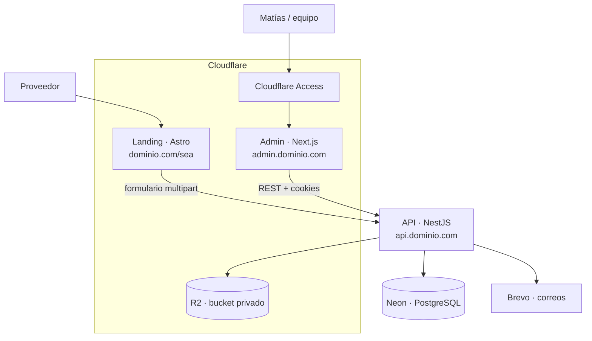
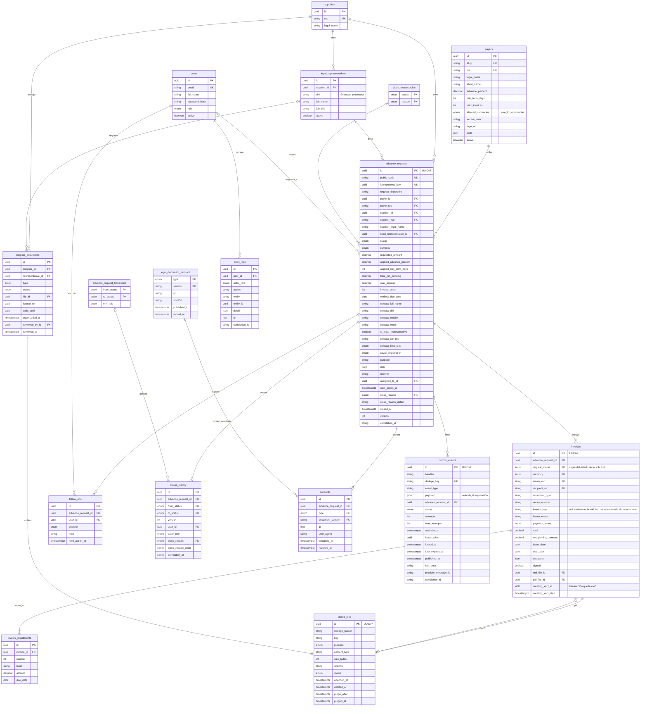
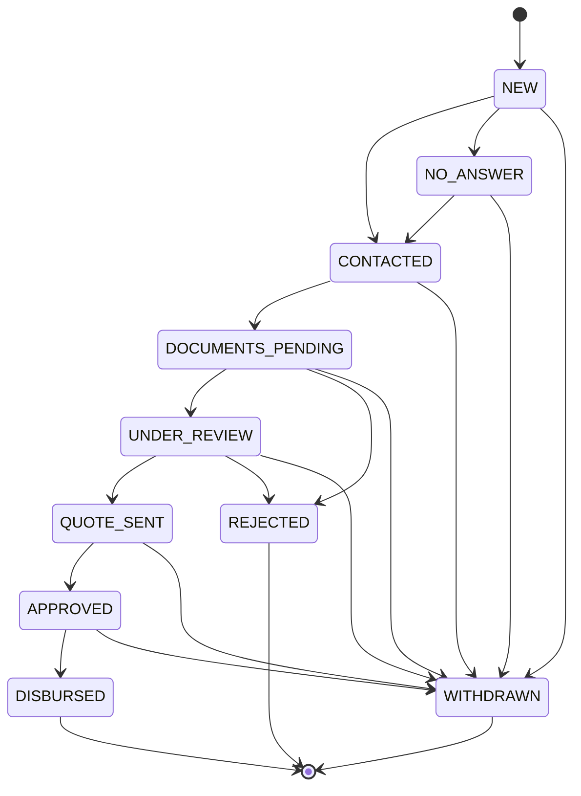

# Anticipate Factoring · Stack y arquitectura

> Documento vivo. Registra qué usamos, cómo se conecta y por qué lo elegimos.
> Cuando cambie una decisión, se actualiza aquí y en el [registro de decisiones](#13-registro-de-decisiones).

| | |
|---|---|
| **Estado** | Borrador v0.8 |
| **Última actualización** | 2026-09-26 |
| **Alcance** | Landing multiempresa + API + admin para gestión de solicitudes |

---

## Índice

1. [Contexto y objetivo](#1-contexto-y-objetivo)
2. [Alcance de la primera versión](#2-alcance-de-la-primera-versión)
3. [Arquitectura general](#3-arquitectura-general)
4. [Stack por capa](#4-stack-por-capa)
5. [Estructura del monorepo](#5-estructura-del-monorepo)
6. [Landing (Astro)](#6-landing-astro)
7. [Admin (Next.js)](#7-admin-nextjs)
8. [API (NestJS)](#8-api-nestjs)
9. [Base de datos (Neon + Prisma)](#9-base-de-datos-neon--prisma)
10. [Archivos, correos y notificaciones](#10-archivos-correos-y-notificaciones)
11. [Seguridad y cumplimiento](#11-seguridad-y-cumplimiento)
12. [Infraestructura, entornos y despliegue](#12-infraestructura-entornos-y-despliegue)
13. [Registro de decisiones](#13-registro-de-decisiones)
14. [Decisiones pendientes](#14-decisiones-pendientes)
15. [Hoja de ruta](#15-hoja-de-ruta)

---

## 1. Contexto y objetivo

Anticipate Factoring adelanta a los proveedores el dinero de las facturas que emitieron a empresas grandes (las **empresas pagadoras**). La primera pagadora es **SEA · Servicios Energéticos Ambientales**, pero el sistema debe servir para varias desde el inicio.

**Flujo completo de una operación de factoring** (tomado como referencia del mercado):

| Paso | Qué pasa | Quién |
|---|---|---|
| 1 · Registro | El proveedor deja sus datos y los de su empresa, y entrega la documentación del representante legal | Proveedor |
| 2 · Venta de facturas | El proveedor envía las facturas a ceder (XML) y recibe una **proforma** con monto, tasa y neto a desembolsar | Proveedor y equipo |
| 3 · Aprobación y cesión | Se evalúa, se firma el contrato y se cede la factura | Equipo y representante legal |
| 4 · Desembolso | Se abona el adelanto, idealmente el mismo día de la aprobación | Equipo |

**Lo que resolvemos en la primera versión** es la entrada de ese flujo: el proveedor entra a la landing de su empresa pagadora, deja sus datos y adjunta sus facturas electrónicas. El sistema valida las facturas, las guarda y avisa al equipo comercial. Desde el admin, Matías revisa la solicitud, llama al proveedor, reúne la documentación y registra el seguimiento hasta cerrar la operación. La proforma, la firma y el desembolso se gestionan fuera del sistema al inicio y se incorporan por fases.

**Requisitos para el proveedor**

| Requisito | Cómo se verifica |
|---|---|
| Empresa con RUC activo y habido | Consulta a SUNAT (manual al inicio, automática en una fase posterior) |
| Factura por cobrar a una empresa pagadora del programa | RUC receptor del XML |
| Factura pendiente de pago y dentro del plazo de vencimiento | Forma de pago y cuotas del XML |

**Documentos del proveedor**

| Documento | Regla |
|---|---|
| Copia del DNI del representante legal | Legible y vigente |
| Vigencia de poder del representante legal (certificado de SUNARP) | Emitida hace 90 días o menos al momento de la operación |
| Contrato firmado por el representante legal | Se firma una vez y sirve para las siguientes operaciones |
| XML de las facturas a ceder | Uno por factura; es el comprobante legal (el PDF es solo su representación impresa) |

**Glosario**

| Término | Significado |
|---|---|
| Pagador | Empresa que debe pagar la factura (SEA y las que vengan). Es la unidad multiempresa del sistema. |
| Proveedor | Empresa que emitió la factura al pagador y pide el adelanto. Se identifica por su RUC. |
| Solicitud | Pedido de adelanto de un proveedor sobre una o varias facturas del mismo pagador. Tiene un código público (`ANT-2026-000123`) y un estado. |
| Representante legal | Persona que puede firmar por el proveedor. Un proveedor puede tener más de uno. |
| Documentos del proveedor | DNI del representante, vigencia de poder y contrato. Pertenecen a la empresa, no a una solicitud, y se reutilizan entre operaciones. |
| Proforma | Propuesta que recibe el proveedor: monto a adelantar, tasa, comisiones y neto a desembolsar. |
| Cesión | Transferencia de la factura a Anticipate; desde ahí el pagador le paga a Anticipate al vencimiento. |
| Seguimiento | Cada contacto registrado por el equipo (llamada, WhatsApp, correo) con su nota y próxima acción. |

**Convención de nombres en el código**

Identificadores en inglés (archivos, funciones, tipos, propiedades, valores de enums, modelos y columnas), igual que en el resto de proyectos de Anticipate. Español en todo lo que lee una persona: mensajes, textos, documentación, comentarios y commits. Los términos legales peruanos sin traducción real se quedan como préstamos (`ruc`, `dni`, `sunat`, `sunarp`, `cavali`). Los literales que SUNAT define en el XML (`FormaPago`, `Credito`, `Cuota001`, `Detraccion`) no se traducen.

| Término del documento | Nombre en el código |
|---|---|
| Pagador | `Payer` |
| Proveedor | `Supplier` |
| Solicitud | `AdvanceRequest` |
| Factura, cuota | `Invoice`, `Installment` |
| Serie y número | `seriesNumber` |
| Emisor, receptor | `issuer`, `recipient` |
| Forma de pago (contado, crédito) | `paymentTerms` (`CASH`, `CREDIT`) |
| Monto neto pendiente | `netPendingAmount` |
| Detracción, retención, percepción | `detraction`, `withholding`, `perception` |
| Representante legal | `LegalRepresentative` |
| Documento del proveedor | `SupplierDocument` (`REPRESENTATIVE_ID`, `POWER_OF_ATTORNEY_CERTIFICATE`, `MASTER_AGREEMENT`, `OTHER`) |
| Seguimiento | `FollowUp` |
| Historial de estado | `StatusHistory` |
| Consentimiento | `Consent` |
| Archivo | `StoredFile` |
| Auditoría | `AuditLog` |
| Proforma, cesión, desembolso | `Quote`, `Assignment`, `Disbursement` |
| Estados de la solicitud | `NEW`, `NO_ANSWER`, `CONTACTED`, `DOCUMENTS_PENDING`, `UNDER_REVIEW`, `QUOTE_SENT`, `APPROVED`, `DISBURSED`, `REJECTED`, `WITHDRAWN` |
| Motivos de cierre | `NO_RESPONSE`, `SPAM_OR_INVALID`, `SUPPLIER_WITHDREW`, `INVALID_DOCUMENTS`, `INVOICE_NOT_ELIGIBLE`, `UNACCEPTABLE_RISK`, `OTHER` |
| Roles | `AGENT` (gestor), `ADMIN` |

La sección 9 usa los nombres reales de la base: tablas y columnas en `snake_case` y valores de enum en inglés, los mismos de `apps/api/prisma/schema.prisma`.

---

## 2. Alcance de la primera versión

**Incluye**

| Área | Qué entra |
|---|---|
| Landing | Una página por pagador en `dominio.com/{pagador}` con calculadora, cómo funciona, requisitos, formulario y preguntas frecuentes (diseño base: prototipo de Claude Design). |
| Formulario | Datos de contacto, empresa, financiamiento, una o varias facturas (XML obligatorio, PDF opcional), consentimientos y antispam. Sin crear cuenta. |
| Validación de factura | Lectura del XML UBL: RUC receptor igual al del pagador, RUC emisor igual al del proveedor, factura al crédito, monto dentro del porcentaje permitido sobre el neto pendiente, factura no duplicada. |
| Admin | Login, bandeja de solicitudes con filtros, detalle con archivos, cambio de estado, notas de seguimiento, documentos del proveedor (checklist con vencimientos), gestión de pagadores y usuarios. |
| Notificaciones | Correo de confirmación al proveedor y aviso al equipo por cada solicitud nueva. |
| Auditoría | Historial de cambios de estado y registro de quién vio cada factura. |

**No incluye (fases siguientes)**: enlace seguro para que el proveedor suba sus documentos, portal del proveedor con cuenta, generación de proformas, firma digital del contrato y de la cesión, integración con Cavali, consulta automática a SUNAT, acceso de los pagadores a sus propias solicitudes y notificaciones por WhatsApp.

En la primera versión, los documentos del representante legal los recibe Matías después de la llamada (correo o WhatsApp) y los sube él desde el admin.

---

## 3. Arquitectura general



Todo el tráfico entra por Cloudflare (DNS, SSL, WAF). La landing y el admin corren en Cloudflare Workers; la API corre en el hosting propio detrás del proxy de Cloudflare. **La API es la única pieza que toca la base de datos y el almacenamiento**: la landing y el admin solo hablan con la API.

| Dominio | Qué sirve | Dónde corre |
|---|---|---|
| `dominio.com/{pagador}` | Landing de cada pagador | Cloudflare Workers (sitio estático) |
| `admin.dominio.com` | Admin interno | Cloudflare Workers (OpenNext) + Cloudflare Access |
| `api.dominio.com` | API REST | Hosting propio, proxied por Cloudflare |
| `app.dominio.com` | Portal del proveedor (fase posterior) | Cloudflare Workers (OpenNext) |

---

## 4. Stack por capa

| Capa | Tecnología | Uso |
|---|---|---|
| Lenguaje | TypeScript 6 (modo `strict`; 7.0 no lo soportan el CLI de NestJS ni @nestjs/swagger) | En todo el monorepo |
| Runtime | Node.js 24 LTS | API y herramientas |
| Monorepo | pnpm workspaces + Turborepo | Dependencias, tareas y caché de builds |
| Landing | Astro + islas de React | Páginas estáticas por pagador; solo el formulario es interactivo |
| Admin | Next.js (App Router) | Interfaz interna; sin lógica de negocio propia |
| API | NestJS | Toda la lógica de negocio |
| Validación y contratos | Zod 4 + validación nativa de NestJS 12 (Standard Schema, D32) | Mismos esquemas en formulario, admin y API |
| Documentación API | OpenAPI generado por @nestjs/swagger 12 directamente desde los esquemas Zod (≥ 4.2, sin conversor) | Contrato entre API y frontends |
| Cliente API | Orval | Genera cliente tipado y hooks de TanStack Query |
| Estado del servidor | TanStack Query | Datos que vienen de la API |
| Estado en URL | `nuqs` | Filtros, búsqueda y paginación del admin |
| Formularios | React Hook Form + `zodResolver` | Landing y admin |
| Tablas | TanStack Table | Bandeja de solicitudes |
| UI | shadcn/ui + Tailwind CSS v4 | Componentes compartidos en `packages/ui` |
| Tokens de diseño | Variables CSS (`tokens.css`) | Tema base + color de marca por pagador |
| Base de datos | Neon (PostgreSQL 18, D48) | Datos del sistema; las invariantes del negocio las garantiza la base (D49) |
| ORM | Prisma 7.10.0 fijo, con `@prisma/adapter-pg` y `pg` (D40) | Esquema, migraciones y tipos; cliente generado en `apps/api/src/infrastructure/prisma/generated` |
| Archivos | Cloudflare R2 vía `@aws-sdk/client-s3` | PDF y XML de facturas |
| Lectura de XML | `fast-xml-parser` | Factura electrónica UBL |
| Correos | Brevo (API transaccional) + React Email 6: `@react-email/render` en tiempo de ejecución y los componentes de `react-email` dentro del `dist` del paquete (`react-email` es de desarrollo) | Plantillas en `packages/emails` |
| Antispam | Cloudflare Turnstile | Formulario público |
| Auth | JWT en cookies httpOnly + argon2 | Login del admin |
| Logs | `nestjs-pino` | Logs estructurados |
| Errores | Sentry | Landing, admin y API |
| Salud | `@nestjs/terminus` | `GET /health` (liveness) y `GET /health/readiness` (base, almacenamiento y backlog del outbox), D47 |
| Calidad | Biome | Linter y formateo |
| Tests | Vitest + Supertest + Playwright | Unitarios, API y flujo completo |
| CI/CD | GitHub Actions | Lint, tipos, tests, build y despliegue |
| Fechas | `date-fns` | date-fns 4 con `@date-fns/tz`; fechas de negocio como calendario ISO, instantes en UTC, "hoy" calculado una vez en `America/Lima` |
| Montos | decimal.js 10 (instancia propia con `Decimal.clone`) | Aritmética de montos en `packages/shared`; texto con dos decimales en los bordes; límite `Decimal(14, 2)` |
| Entorno local | Docker Compose | PostgreSQL, almacenamiento compatible con S3 (S3Mock) y correo de prueba (Mailpit) |
| Contenedor de la API | Docker (imagen multi-etapa, D42) | La misma imagen se prueba en local, CI y producción |

> **Versiones**: se fijan al crear el repositorio (última estable de cada una) y se registran en los `package.json`. Actualizaciones mayores, con PR propio.

---

## 5. Estructura del monorepo

```
anticipate/
├── apps/
│   ├── landing/        Astro · páginas por pagador y formulario
│   ├── admin/          Next.js · admin interno
│   └── api/            NestJS + Prisma · única app que toca BD y archivos
├── packages/
│   ├── shared/         Esquemas Zod, tipos, reglas de factura, lector UBL, máquina de estados, validadores RUC/DNI
│   ├── ui/             Componentes shadcn + tokens.css
│   ├── api-client/     Cliente y hooks generados por Orval (no se edita a mano)
│   ├── emails/         Plantillas React Email
│   └── config/         Presets de tsconfig (Biome se configura en biome.json, en la raíz)
├── docs/               Este documento y decisiones
├── docker/             Scripts de inicialización de los servicios locales
├── .github/workflows/  CI/CD
├── docker-compose.yml  Infraestructura local
├── turbo.json
└── pnpm-workspace.yaml
```

**Reglas de dependencia**

Las apps pueden importar de `packages/*`; los paquetes nunca importan de las apps. `packages/shared` no depende de nada del monorepo y no tiene código de servidor ni de navegador: solo esquemas, tipos y funciones puras. Así se puede usar en la landing, el admin y la API sin arrastrar dependencias.

**Flujo del contrato API**

```
Esquema Zod (packages/shared)
   → Validación en NestJS con el mismo esquema (Standard Schema nativo, D32)
   → OpenAPI generado por la API
   → Orval genera packages/api-client
   → Admin usa los hooks tipados
```

Si alguien cambia un endpoint, el admin deja de compilar en CI antes de llegar a producción.

---

## 6. Landing (Astro)

**Rutas y generación**

La landing es estática. Una sola ruta dinámica `src/pages/[pagador].astro` genera una página por cada pagador activo: en el build, `getStaticPaths` pide a la API la lista pública de pagadores (`GET /api/v1/payers`) con su nombre, logo, porcentaje de adelanto, color de marca y textos. Cuando se crea o edita un pagador en el admin, la API dispara un *deploy hook* y la landing se reconstruye en alrededor de un minuto. La respuesta de `GET /api/v1/payers` lleva caché pública de 5 minutos: el build tiene que saltarla o purgarla (sección 14).

La raíz `dominio.com` puede mostrar una página general de Anticipate o redirigir; queda como decisión de negocio.

**Interactividad mínima**

Todo es HTML y CSS salvo dos islas de React: la calculadora y el formulario. El formulario usa React Hook Form con el esquema Zod de `packages/shared`, componentes de `packages/ui` y el widget de Turnstile. Se envía como `multipart/form-data` a `POST /api/v1/advance-requests`, con las cabeceras `x-turnstile-token` e `Idempotency-Key` (D38, D45).

**Contenido alineado al proceso**

La sección "Cómo funciona" sigue los pasos reales (registro, envío de facturas y proforma, aprobación y cesión, desembolso). La sección de requisitos muestra tanto los requisitos como los documentos que se pedirán después (DNI y vigencia de poder del representante legal, contrato), para que el proveedor llegue a la llamada preparado. Se agrega una guía corta de cómo descargar el XML de la factura desde SUNAT o desde el sistema de facturación, porque es el paso donde más proveedores se traban.

**Qué captura además de los campos**

Los parámetros UTM y el `referrer` de la visita (para saber qué canal trae solicitudes por pagador), y el token de Turnstile.

**Campos del formulario**

| Bloque | Campos |
|---|---|
| Tus datos | Nombre completo, DNI, celular, correo, ¿es representante legal? (si no: cargo), horario preferido de contacto |
| Tu empresa | RUC, razón social |
| Financiamiento | Monto total a financiar, motivo |
| Facturas (una o varias, del mismo pagador) | Por cada una: XML (obligatorio) y PDF (opcional). Además: ¿ya están registradas en Cavali? (Sí / No / No sé) |
| Consentimientos | Términos y condiciones, tratamiento de datos personales (Ley 29733) |

Moneda, montos y vencimientos salen del XML de cada factura; el formulario no los pide. Si se lee el XML en el navegador, se puede mostrar un resumen antes de enviar; la validación que vale siempre es la de la API.

**Tema por pagador**

El color principal es siempre el de Anticipate. Cada pagador aporta solo un color de acento (`--acento-pagador`), que se usa con moderación junto a su logo. El admin valida el contraste al guardar ese color.

**Estado de la implementación (v0.3)**

La landing de la v0.3 se construyó en un proyecto aparte, fuera de este monorepo, con la página `/{pagador}` generada desde datos de ejemplo mientras no exista la API; entra a este repositorio como `apps/landing` en una fase siguiente. Decisiones tomadas al construirla, que se conservan al moverla:

| Tema | Cómo quedó |
|---|---|
| Orden del formulario | 1 Facturas, 2 Empresa, 3 Tus datos, 4 Adelanto. Se empieza por las facturas porque de ellas salen el RUC, la razón social, la moneda y el monto máximo |
| Lectura del XML | En el navegador, con el mismo lector y las mismas reglas de `packages/shared` que usará la API. El proveedor ve cada factura leída y los problemas antes de enviar |
| Monto | Se prellena con el máximo (porcentaje del pagador sobre el neto pendiente de las facturas válidas); el proveedor puede pedir menos |
| Sin API configurada | Modo demostración: no envía datos y lo indica en la confirmación |
| Datos de prueba | XML ficticios (válidas, al contado, vencida, en dólares, emitida a otro, boleta y CDR). En este monorepo salen de la fábrica de `@anticipate/shared/testing`; `packages/shared/test/fixtures` guarda solo la factura al crédito en soles y la suite dorada, los casos semilla |
| Componentes | Escritos a mano siguiendo las convenciones de shadcn/ui; los siguientes se agregan con su CLI |

**SEO y medición**

Título, descripción y etiquetas Open Graph por pagador; analítica de conversión (visita → envío del formulario) por pagador y canal.

---

## 7. Admin (Next.js)

**Principio**: el admin es solo interfaz. No usa Server Actions ni rutas API de Next.js para lógica de negocio; todo pasa por la API de NestJS con los hooks generados por Orval.

**Pantallas**

| Pantalla | Contenido |
|---|---|
| Login | Correo y contraseña contra la API |
| Bandeja de solicitudes | Tabla con filtros por estado, pagador, fecha y RUC; búsqueda; paginación. Filtros en la URL (`nuqs`) para recargar o compartir la vista |
| Detalle de solicitud | Datos de contacto y empresa, facturas con los datos leídos de cada XML, ver o descargar PDF y XML, botones de llamar (`tel:`) y WhatsApp (`wa.me/51…`), cambio de estado, historial y notas de seguimiento con próxima acción |
| Proveedor | Datos de la empresa, representantes legales, checklist de documentos (pendiente, aprobado, rechazado, vencido) con carga de archivos, historial de solicitudes |
| Pagadores | Crear y editar: razón social, RUC, slug, logo, color de marca, porcentaje de adelanto, textos, activo/inactivo |
| Usuarios | Alta, baja y rol |

**Estado en el cliente**

| Tipo de estado | Herramienta |
|---|---|
| Datos de la API | TanStack Query |
| Filtros, búsqueda, paginación | URL con `nuqs` |
| Formularios | React Hook Form |
| Estado visual local | `useState` |
| Estado global del cliente | No se usa por ahora. Si aparece una necesidad real, Zustand |

**Despliegue**

En Cloudflare Workers con el adaptador oficial de OpenNext (`@opennextjs/cloudflare`). El Worker tiene un tamaño máximo según el plan de Cloudflare; si el admin lo supera en el plan gratuito, se pasa al plan pago de Workers.

---

## 8. API (NestJS)

**Organización**

`apps/api` es NestJS 12 en ESM. Sus piezas:

- **Capas de cada módulo (D44).**
  - `domain/`: TypeScript puro.
  - `application/`: puertos, casos de uso, servicios y handlers, sin Nest ni Prisma.
  - `presentation/http/`: controladores, pipes, decoradores, mappers de respuesta y Swagger.
- **Cableado.** El `*.module.ts` conecta cada clase con `useFactory` + `inject`, contra tokens `Symbol` definidos junto a su puerto.
- **Carpetas.** Los adaptadores (Prisma, S3, SMTP, Brevo, Turnstile y el reloj) viven en `src/infrastructure/`. Lo transversal va en `src/common/`: configuración, errores, filtro, interceptores, guards, middleware y puertos comunes. Los procesos en segundo plano están en `src/workers/`.
- **Imports.** Los internos usan subpath imports de Node (`#/*`): en desarrollo apuntan a `src` y en la imagen, a `dist`.
- **Reglas.** `src/architecture.test.ts` hace cumplir las reglas de dependencia entre capas.

El detalle está en `apps/api/PROJECT_STRUCTURE.md`.

**Módulos**

| Módulo | Responsabilidad | Cuándo |
|---|---|---|
| `common/config` | Un esquema Zod por tema; si falta, sobra o es inválida una variable, la API no arranca (D37) | Paso 2 |
| `infrastructure/prisma` | Cliente de Prisma sobre un pool de `pg`, ids UUIDv7, conversores de montos y fechas, traducción de errores de la base | Paso 2 |
| `health-checks` | Liveness y readiness (D47) | Paso 2 |
| `payers` | Pagadores activos y su configuración pública para la landing | Paso 2 |
| `advance-requests` | Creación de solicitudes desde la landing | Paso 2; bandeja, detalle y cambios de estado en el paso 4 |
| `outbox` y `notifications` | Outbox transaccional, publicador con reintentos y envío de correos con Brevo (D39) | Paso 2 |
| `maintenance` | Purga del outbox, barrido de archivos huérfanos y borrado diferido (D50) | Paso 2 |
| `common/storage` e `infrastructure/storage/s3` | Único punto de acceso a R2: puerto `FileStoragePort` y adaptador S3 | Paso 2 |
| `common/captcha` e `infrastructure/captcha/turnstile` | Verificación de Turnstile antes de leer el cuerpo: puerto `CaptchaVerifierPort` y adaptador de siteverify | Paso 2 |
| `auth`, `users`, `suppliers`, `follow-ups`, `audit` | Sesión del admin, usuarios y roles, proveedores con representantes y documentos, seguimientos, auditoría | Paso 4 |

**Endpoints**

Las rutas de negocio van bajo `/api/v1`: prefijo `api` y versión en la URI (D46). `/health` y `/health/readiness` quedan fuera del prefijo. Swagger se sirve en `/docs`, salvo en producción.

| Método | Ruta | Acceso | Uso | Cuándo |
|---|---|---|---|---|
| `GET` | `/api/v1/payers` | Público | Pagadores activos (solo campos públicos) para el build de la landing; `Cache-Control: public, max-age=300` | Paso 2 |
| `POST` | `/api/v1/advance-requests` | Público + Turnstile + `Idempotency-Key` | Crear una solicitud con sus XML y PDF (D38, D45) | Paso 2 |
| `GET` | `/health` | Monitoreo | Liveness: solo el proceso | Paso 2 |
| `GET` | `/health/readiness` | Monitoreo | Base, almacenamiento y backlog del outbox; 503 si algo falla | Paso 2 |
| `POST` | `/api/v1/auth/login` · `/api/v1/auth/refresh` · `/api/v1/auth/logout` | Público / sesión | Sesión del admin | Paso 4 |
| `GET` | `/api/v1/auth/me` | Sesión | Usuario actual | Paso 4 |
| `GET` | `/api/v1/admin/advance-requests` | Sesión | Bandeja con filtros, paginada por cursor | Paso 4 |
| `GET` | `/api/v1/admin/advance-requests/:id` | Sesión | Detalle | Paso 4 |
| `PATCH` | `/api/v1/admin/advance-requests/:id/status` | Sesión | Cambiar estado (queda en el historial; 409 si otra persona la cambió antes) | Paso 4 |
| `POST` | `/api/v1/admin/advance-requests/:id/follow-ups` | Sesión | Registrar contacto y próxima acción | Paso 4 |
| `GET` | `/api/v1/admin/suppliers/:id` | Sesión | Detalle con representantes, documentos y solicitudes | Paso 4 |
| `POST` | `/api/v1/admin/suppliers/:id/documents` | Sesión | Subir un documento del proveedor | Paso 4 |
| `PATCH` | `/api/v1/admin/suppliers/:id/documents/:documentId` | Sesión | Aprobar o rechazar un documento | Paso 4 |
| `POST` | `/api/v1/admin/suppliers/:id/representatives` | Sesión | Crear un representante legal (único por proveedor y DNI) | Paso 4 |
| `GET` | `/api/v1/admin/files/:id/url` | Sesión | Enlace firmado de 5 minutos para cualquier archivo (queda en auditoría) | Paso 4 |
| `*` | `/api/v1/admin/payers` · `/api/v1/admin/users` | Rol admin | Gestión | Paso 4 |

**Flujo de creación de solicitud**

Cada barrera descarta primero lo más barato. Nada se sube si algo falla antes de la subida, y nada queda subido sin su fila.

1. Revisar el `Content-Length` antes de leer el cuerpo: sin tamaño declarado, 411; mayor que el máximo, 413.
2. Aplicar el límite de envíos por IP (429).
3. Verificar Turnstile con la cabecera `x-turnstile-token` antes de leer los archivos: 403 `CAPTCHA_FAILED` si el token no vale (falta, venció, ya se usó o es de otro sitio); 503 `SERVICE_UNAVAILABLE` con un log de error y los códigos de Cloudflare si siteverify se niega por otro motivo (clave secreta equivocada o rotada, petición mal formada, error interno), porque no es culpa del visitante; 503 `CAPTCHA_UNAVAILABLE` si Cloudflare no responde. Si la `Idempotency-Key` es un UUID válido, la API se la pasa a siteverify, así un reintento puede revalidar el mismo token.
4. Leer el multipart en memoria con topes de cantidad (400) y validar el campo `form` con el esquema de `shared` (400, con las violaciones por campo). La cabecera `Idempotency-Key` es obligatoria y debe ser un UUID (400).
5. Calcular la huella del envío: formulario normalizado y SHA-256 de cada archivo. Si la clave ya existe con la misma huella, responder el mismo 201 con `Idempotent-Replayed: true`, sin subir ni guardar nada. Si existe con otra huella, 422 `IDEMPOTENCY_KEY_REUSED` (D45).
6. Comprobar el pagador activo del `payerSlug` y las versiones vigentes de los términos y de la política de privacidad (422 si no).
7. Leer cada XML y aplicar las reglas de factura (sección 9), emparejar cada PDF con su XML por nombre base, validar el PDF por contenido y validar el monto pedido. Todos los problemas se responden juntos (422), cada uno con el archivo, la factura o el campo al que se refiere.
8. Descartar las facturas que ya están en una solicitud abierta (422), antes de subir nada. Antes de ese 422 se relee la clave: si el envío original de este reintento confirmó mientras tanto, se responde como reintento y nunca con un falso "factura ya tomada".
9. Reservar los archivos (filas de `stored_files` en `PENDING`) y subirlos al almacenamiento en modo "todo o nada". Si falla, liberar lo reservado, borrar lo subido y responder 503.
10. Guardar todo en una transacción:
    - código público, proveedor y, si el contacto lo es, representante legal;
    - solicitud, con la foto de las condiciones del pagador;
    - archivos a `ATTACHED`, facturas, cuotas, consentimientos e historial inicial;
    - una fila del outbox por correo.
    
    El índice único parcial de facturas abiertas y la clave de idempotencia única son la barrera final ante dos envíos simultáneos. Si la transacción choca con otro envío, se liberan los archivos y se vuelve al paso 8 (hasta tres intentos, después 503) o, si ganó la misma clave, se responde como reintento. Si falla por otra causa, las filas que siguen `PENDING` pasan a `DELETED` y se borran sus objetos; si la base no responde, lo termina el mantenimiento (sección 10).
11. Despertar al publicador del outbox y responder `201` con el código público. Los correos salen fuera de la petición (sección 10).

**Convenciones**

- **Sobre (D43).** Todo éxito y todo error usan el sobre de `@anticipate/shared/api`: `success`, `statusCode`, `message`, `data` o `code` y `details`, `correlationId` y `timestamp`.
- **Mensajes.** Los mensajes para el usuario salen de `API_ERROR_MESSAGES_ES`. Nunca se reenvía el texto de una excepción de Nest ni de una librería.
- **Códigos.** Un error de forma es 400 y un problema de negocio, 422 con todos los problemas juntos. La infraestructura caída es 503 en toda ruta: el filtro traduce los errores de conexión y de tiempo de la base, y el log registra su clase y su código. El 500 queda solo para un defecto del código.
- **Validación.** Se valida en el borde con los esquemas de `shared` (Standard Schema nativo, D32), y los casos de uso reciben datos ya validados.
- **Logs.** Son estructurados, con `nestjs-pino`. Cada petición lleva `x-correlation-id`, que vuelve en la respuesta y queda guardado en la solicitud y en el outbox.

---

## 9. Base de datos (Neon + Prisma)

**Conexión**

PostgreSQL 18 en todos los entornos (D48), con `uuidv7()` nativo para las claves.

| Quién | Variable | Qué usa |
|---|---|---|
| La API | `DATABASE_URL` | La cadena *pooled* de Neon, con un pool de `pg` acotado por `DATABASE_POOL_MAX`, `DATABASE_CONNECTION_TIMEOUT_MS` y `DATABASE_IDLE_TIMEOUT_MS` |
| La CLI de Prisma (migraciones) | `DATABASE_DIRECT_URL` | La conexión directa. Es obligatoria en producción. La guarda de la CLI (`apps/api/prisma/cli-guard.ts`) rechaza un host `*-pooler` en todo entorno y solo deja correr `migrate dev`, `migrate reset` y `db push` contra una base local |
| La revisión de deriva | `SHADOW_DATABASE_URL` | Una base sombra local, distinta de la que se migra (se compara host, puerto y base) |

Tres límites se fijan en la base con `ALTER DATABASE` y no en el pool, porque el pooler de Neon rechaza esos parámetros al conectar (D52):

- `statement_timeout`: 15 s;
- `lock_timeout`: 5 s;
- `idle_in_transaction_session_timeout`: 30 s.

Las migraciones fijan sus propios límites con `SET LOCAL`; un `CREATE INDEX CONCURRENTLY` o una espera larga de `migrate deploy` necesitan que el rol o la URL de migración levanten el `statement_timeout` de la base (sección 14).

La región de Neon y la del servidor de la API se eligen juntas (sección 14).

En local corre PostgreSQL 18 en Docker Compose, con tres bases: `anticipate` (desarrollo), `anticipate_test` (tests de integración) y `anticipate_shadow` (base sombra).

**Ramas de Neon**

| Rama | Uso |
|---|---|
| `main` | Producción |
| `staging` | Pruebas antes de producción |

Los tests de la API en CI corren contra Docker Compose, no contra ramas de Neon (D41).

**Modelo de datos**



Todas las tablas tienen `id` UUIDv7. Lo genera `uuidv7()` en la base, o `newId()` en la API cuando necesita el id antes de insertar. También tienen `created_at`, y las que cambian, `updated_at`, que mantiene el trigger `set_updated_at`.

- **Documentos.** Cuelgan del proveedor y no de la solicitud: el DNI, la vigencia de poder y el contrato se entregan una vez y sirven para las siguientes operaciones mientras sigan vigentes.
- **Archivos.** `stored_files` es una tabla única para todo lo que vive en el almacenamiento (XML, PDF y documentos), así la descarga, la auditoría y la limpieza funcionan igual para cualquier archivo. No guarda el nombre original, porque es un dato personal. Cada referencia a un archivo es una FK compuesta `(id, purpose)`, así una factura solo puede apuntar a un XML o a un PDF de factura. Su ciclo de vida está en la sección 10 (D50).
- **Representantes legales.** Se crean de dos formas:
  - automáticamente al crear la solicitud, cuando el contacto marca que es representante legal (es una autodeclaración y no vale hasta que se aprueben sus documentos);
  - manualmente desde el admin, cuando el representante es otra persona distinta del contacto.
  
  Son únicos por proveedor y DNI, así una segunda solicitud del mismo proveedor no los duplica.
- **Facturas bloqueadas.** Una factura queda bloqueada mientras su solicitud está abierta o desembolsada. `invoices.request_status` copia el estado de la solicitud por la FK compuesta `invoices_request_scope_fkey` (`ON UPDATE CASCADE`). El índice único parcial `invoices_open_invoice_key_key` sobre `invoice_key` excluye `REJECTED` y `WITHDRAWN`. Esto reemplaza la columna `activa` de D26 (D49).

**Invariantes que garantiza la base (D49)**

| Invariante | Cómo |
|---|---|
| Datos válidos | CHECK con nombre `<tabla>_<regla>_check`, espejo de las reglas de `shared`: RUC con `is_valid_ruc`, DNI, celular, correo en minúsculas, montos, fechas, formato del código público y canonización de `invoice_key`. Cada CHECK sobre datos que vienen de afuera tiene una regla gemela en `shared`. Así el usuario recibe 422 con el problema concreto y nunca 503 |
| Alcance de la factura | FK compuesta `(advance_request_id, request_status, currency, issuer_ruc, recipient_ruc)` → `advance_requests (id, status, currency, supplier_ruc, payer_ruc)`: misma moneda, emisor = proveedor y receptor = pagador. El estado se copia en cascada |
| Máquina de estados | `advance_request_transitions` y `close_reason_rules`, sembradas desde `TRANSITIONS` y `CLOSE_REASONS_BY_STATUS` de `shared` (un test las compara). El trigger `advance_requests_guard` rechaza una transición que no está en la tabla y exige que `version` suba de a uno |
| Identidad inmutable | Los triggers `advance_requests_guard`, `invoices_guard`, `stored_files_guard` y `outbox_events_guard` impiden cambiar lo que identifica una fila |
| Solo inserción | `status_history` y `audit_logs` rechazan UPDATE y DELETE (`reject_append_only_mutation`). En `consents` solo se puede fijar `revoked_at` |
| Agregado completo | El trigger diferido `advance_requests_complete` comprueba al confirmar que la solicitud tiene: facturas; `invoice_count` y `earliest_due_date` correctos; la suma de netos igual a `total_net_pending`; los dos consentimientos; y su historial inicial. La misma regla se vuelve a comprobar al confirmar cualquier factura o cuota que se inserte después (`invoices_complete`, `invoice_installments_complete`), y una solicitud solo puede nacer en `NEW` con versión 1 (`advance_requests_initial_state`) |
| Cuotas solo con su factura | `invoice_installments_same_transaction` (AFTER INSERT por fila) rechaza una cuota que no entra en la misma transacción que creó su factura, y trata una factura que no encuentra como violación: así no hay carrera en `READ COMMITTED`. La factura guarda `creating_xact_id` (el `xid8` de la transacción) y `creating_xact_start` (su `transaction_timestamp()`), fijados por trigger e inmutables; el instante cubre una copia lógica a otro clúster, donde el xid solo no alcanza (sección 14) |
| Purga por retención | Las tablas de solo inserción admiten DELETE solo con `SET LOCAL app.retention_purge = 'on'`, pensado para la purga futura por retención. Cuatro triggers diferidos (`*_purge_requires_*_purge`) impiden usarlo para borrar una parte de un agregado vivo: facturas, cuotas, consentimientos o historial sin su solicitud o su factura. Quién puede encenderlo lo definen los roles de la base (sección 14) |
| Funciones blindadas | Toda función PL/pgSQL fija `search_path = pg_catalog, public, pg_temp`: una tabla temporal con el nombre de una tabla real no engaña a un trigger. El test estructural lo exige en todas |
| Claves de almacenamiento | `stored_files_key_check` exige la misma regla que el adaptador de almacenamiento (`objectKeyProblem`): no vacía, sin `/` inicial, sin segmentos vacíos, `.` ni `..`, sin caracteres de control y hasta 1024 bytes. Una clave así apuntaría al bucket o a otra clave; ninguna fila puede guardarla |
| Unicidad | `advance_requests_idempotency_key_key`, `invoices_open_invoice_key_key`, `status_history_advance_request_id_version_key` (con `status_history_initial_check`, una sola fila inicial por solicitud) y `outbox_events_dedupe_key_key` |

**Tipos y estados de documento**

| Tipo | Vigencia |
|---|---|
| `REPRESENTATIVE_ID` | Hasta la fecha de caducidad del DNI |
| `POWER_OF_ATTORNEY_CERTIFICATE` | 90 días desde su emisión (`valid_until = issued_on + 90`) |
| `MASTER_AGREEMENT` | Sin vencimiento mientras no se reemplace |
| `OTHER` | Según el caso |

Hay tres estados: `PENDING_REVIEW`, `APPROVED` y `REJECTED`.

- Un documento aprobado cuyo `valid_until` ya pasó se muestra como vencido; no hace falta un estado aparte.
- Al aprobar otro documento del mismo proveedor, tipo y representante, el anterior recibe `superseded_at`.

**Estados de una solicitud**



Las transiciones viven en `packages/shared` (`TRANSITIONS`) y la base guarda una copia en `advance_request_transitions`, con `min_role`. Cada cambio queda en `status_history`. Una solicitud solo puede pasar a `UNDER_REVIEW` si el proveedor tiene sus documentos aprobados y vigentes.

**Reglas de la máquina de estados**

| Regla | Cómo se implementa |
|---|---|
| Transiciones como datos | La tabla `TRANSITIONS` de `packages/shared` (`{ from, to, guard?, minRole?, requiresReason? }`) se copia a `advance_request_transitions` en la migración `integrity`. El admin la lee para mostrar solo los botones válidos, la API la usa para rechazar cualquier otro cambio y la base lo vuelve a comprobar con un trigger. Nunca `if` sueltos en servicios |
| Guardas con nombre | Funciones puras y testeadas: `documentsValid` para entrar a `UNDER_REVIEW` y `quoteAccepted` para `APPROVED`. La guarda vive junto a la transición, no repartida por el código. `documentsValid` está en `packages/shared` (dominio `supplier-document`): recibe documentos, representantes, "hoy" y los requisitos de la configuración. `evaluateDocumentsValidity` devuelve además lo que falta para el checklist del admin |
| Cierre siempre posible | Toda solicitud puede cerrarse desde cualquier estado no terminal. `WITHDRAWN`: el proveedor se retira, no responde tras los intentos definidos o la solicitud es spam o inválida. `REJECTED`: Anticipate la descarta por evaluación o por documentos |
| Motivo codificado | Los cierres exigen `close_reason` (`NO_RESPONSE`, `SPAM_OR_INVALID`, `SUPPLIER_WITHDREW`, `INVALID_DOCUMENTS`, `INVOICE_NOT_ELIGIBLE`, `UNACCEPTABLE_RISK`, `OTHER`), válido para el estado según `close_reason_rules`. Con `OTHER`, `close_reason_detail` es obligatorio. Así se mide por qué se pierden solicitudes sin inventar estados |
| Estados terminales inmutables | `DISBURSED`, `REJECTED` y `WITHDRAWN` no tienen salida. Si algún día hace falta reabrir, se agrega como transición explícita con rol admin y queda en el historial; nunca editando el estado a mano |
| Un cambio, una transacción | Cambio de estado, fila en `status_history`, efectos y evento en `outbox_events` se escriben en la misma transacción. Al cerrar, la FK de alcance copia el estado a las facturas y el índice parcial las libera, salvo con `DISBURSED` |
| Bloqueo optimista | `advance_requests.version` sube en cada cambio, y el trigger exige `+1`. El admin envía la versión que vio. La API hace `UPDATE ... WHERE id = ? AND version = ?` y responde 409 si otra persona cambió la solicitud antes (paso 4) |
| Test estructural | Un test recorre la tabla de transiciones y falla si algún estado no terminal no tiene camino a uno terminal, o si aparece un estado sin entrada. Otro compara la tabla de `shared` con `advance_request_transitions`. Los callejones sin salida se detectan en CI, no en producción |

**Reglas de la factura (lectura del XML UBL)**

| Regla | Detalle |
|---|---|
| Tipo de comprobante | Factura electrónica (código 01) |
| RUC receptor | Igual al RUC del pagador de la landing |
| RUC emisor | Igual al RUC que ingresó el proveedor; todas las facturas de una solicitud son del mismo emisor |
| Forma de pago | Crédito. Una factura al contado no tiene saldo por cobrar |
| Base del adelanto | El monto neto pendiente de pago que declara el XML (descuenta detracción o retención), no el total |
| Neto pendiente | Mayor que cero y no mayor que el total |
| Fecha de emisión | No futura y no posterior a ninguna fecha de vencimiento de sus cuotas |
| Monto | Monto solicitado ≤ suma de los netos pendientes × porcentaje de adelanto del pagador, con redondeo hacia abajo. La solicitud guarda la foto de las condiciones aplicadas: `applied_advance_percent`, `applied_min_term_days`, `total_net_pending` y `max_amount` |
| Moneda | Todas las facturas de una solicitud en la misma moneda, y una moneda que el pagador acepta (`allowed_currencies`) |
| Vencimiento | Fechas de las cuotas del XML, a no menos de `min_term_days` días (dato del pagador) |
| Cantidad | Hasta `max_invoices` facturas por solicitud (dato del pagador) |
| Duplicados | No puede haber dos solicitudes abiertas, ni una desembolsada, con la misma factura. La clave canónica `invoice_key` (RUC emisor + serie + número sin ceros a la izquierda) iguala `F001-00000123` y `F001-123`. El índice único parcial `invoices_open_invoice_key_key` (`request_status <> ALL (ARRAY['REJECTED', 'WITHDRAWN'])`) se declara en `schema.prisma` con la vista previa `partialIndexes` y resuelve la carrera de dos envíos simultáneos. El estado de la solicitud lo copia la FK de alcance |

Antes de fijar estas reglas en código se validan con XML reales de proveedores de SEA (sección 14).

**Convenciones de datos**

- **Montos.** `Decimal(14, 2)`, con la moneda en su propia columna (`PEN`, `USD`). Los porcentajes van en `Decimal(5, 2)`. Nunca `float`. En JSON viajan como texto (`"25000.00"`).
- **Fechas.** Las fechas de negocio son `date` y los instantes, `timestamptz(3)` en UTC, que se muestran en `America/Lima`.
- **Identificadores.** Son UUIDv7: el orden por `id` es el de creación, y lo garantiza la CHECK `uuid_extract_version(id) = 7`. El código público `ANT-{año}-{secuencia}` sale de la secuencia `advance_request_code_seq`.
- **Nombres.** Tablas y columnas en `snake_case`; en el código, `camelCase` con `@map`.
- **Relaciones.** Toda relación con `onDelete: Restrict`, y toda FK con un índice que empieza por ella.
- **Índices.** Todo índice (parcial, BRIN, GIN de trigramas o descendente) se declara en `schema.prisma` con nombre estable, porque Prisma borra en la migración siguiente los que no declara. Los parciales que consulta el query builder usan predicados de booleanos o `IS NULL`. Los que nombran un enum solo se consultan con SQL crudo, con el literal en el texto.
- **Listas.** Las listas largas del admin se paginan por cursor sobre `id`, sin `count()` por página.

**Migraciones (D51)**

Las reglas completas están en `docs/database/migrations.md`:

- **Transacción.** Cada migración va en una transacción explícita: `BEGIN` con `lock_timeout` y `statement_timeout` locales y `COMMIT` al final, porque Prisma 7.10 no las envuelve. Las de `CREATE INDEX CONCURRENTLY` van aparte.
- **Enums.** Un valor nuevo va en un archivo aparte y se introduce en dos versiones.
- **Columnas.** Quitar o renombrar una columna se hace por expandir y contraer.
- **Restricciones.** Las nuevas, en tablas con datos, se agregan con `NOT VALID` y se validan aparte.

CI revisa tres cosas:

- la deriva entre el esquema y las migraciones (`pnpm db:check-drift`, contra la base sombra);
- las reglas de migración;
- la estructura de la base: FK con índice, CHECK, índices y triggers.

Las migraciones se aplican con `prisma migrate deploy` antes de liberar la versión nueva, nunca en el arranque de la API.

---

## 10. Archivos, correos y notificaciones

**Archivos (Cloudflare R2)**

R2 expone la API de S3, así que la API usa el SDK de AWS apuntando al endpoint de R2. Pasar a AWS S3 en el futuro sería cambiar solo variables de entorno.

| Aspecto | Decisión |
|---|---|
| Buckets | `anticipate-staging` y `anticipate-prod` en R2, privados y sin dominio público. En local, `anticipate-local` en S3Mock (Docker) |
| Credenciales | Token de R2 con permiso de lectura y escritura limitado a un solo bucket |
| Rutas | Facturas: `payers/{payerId}/advance-requests/{advanceRequestId}/invoices/{invoiceId}.{xml\|pdf}`. Documentos: `suppliers/{supplierId}/documents/{documentId}.{ext}`. Siempre ids (UUID validados), nunca slugs ni nombres de archivo del usuario |
| Subida | A través de la API (no directo desde el navegador): se valida antes de guardar |
| Descarga | Enlace firmado de 5 minutos, solo para usuarios con sesión; cada acceso queda en auditoría |
| Integridad | Se guarda el SHA-256 de cada archivo |
| CORS | No se necesita con este flujo |

La API accede al almacenamiento solo por el puerto `FileStoragePort` (`common/storage`). Su adaptador S3 sirve para R2 y para S3Mock, y ofrece:

- `putAll`, todo o nada;
- `deleteQuietly`;
- `exists`;
- `downloadUrl`, con enlaces de 5 minutos.

El adaptador valida cada clave antes de llamar al proveedor: una clave vacía, con `/` inicial o con segmentos `.` o `..` nunca llega a R2, porque se volvería una operación sobre el bucket entero. Cada operación tiene su plazo propio, que corta también la espera entre reintentos, y un tope de peticiones en curso.

Cada objeto tiene su fila en `stored_files`, con un ciclo de vida explícito (D50):

1. La fila se reserva en `PENDING` antes de subir el objeto.
2. Pasa a `ATTACHED` en la misma transacción que guarda la solicitud.
3. Pasa a `DELETED` si esa transacción falla.

El mantenimiento periódico pasa a `DELETED` los `PENDING` más viejos que `STORAGE_ORPHAN_GRACE_MINUTES`. Borra el objeto recién cuando vence `purge_after`. Para un archivo que estuvo `ATTACHED`, `purge_after` llega `STORAGE_DELETE_DELAY_DAYS` (35) días después, más que la ventana de restauración de Neon, así una restauración a un punto anterior nunca apunta a un objeto borrado. Nunca pasa a `DELETED` un archivo que se confirma en ese momento, y dos instancias a la vez no cuentan ni borran nada dos veces. El mantenimiento corre cada `MAINTENANCE_INTERVAL_MS` (1 h por defecto) en cada instancia de la API; al apagarse, la API deja de programar pasadas y espera la que está en curso.

**Correos (Brevo)**

Se usa la API transaccional de Brevo desde el módulo `notifications`, detrás de una interfaz de envío con tres implementaciones:

- `brevo`, para staging y producción;
- `smtp`, hacia Mailpit en local, para que ningún correo de desarrollo le llegue a una persona real;
- `fake`, en memoria, para los tests. La configuración lo rechaza en producción.

El dominio se autentica en Brevo y los registros (SPF, DKIM, DMARC) se cargan en el DNS de Cloudflare para que los correos no caigan en spam. Las plantillas se escriben con React Email en `packages/emails` y se envían como HTML.

| Correo | Destinatario | Cuándo |
|---|---|---|
| Confirmación de solicitud | Proveedor | Al crear la solicitud (código, resumen y próximos pasos) |
| Nueva solicitud | Equipo comercial | Al crear la solicitud (enlace directo al detalle en el admin) |

El envío no ocurre dentro de la petición: se usa el patrón *transactional outbox* (D29 y D39).

- **Escritura.** La misma transacción que guarda la solicitud inserta en `outbox_events` una fila por handler: `email.supplier-confirmation` y `email.team-alert`. Cada fila lleva una clave de deduplicación y un payload con solo los ids, el tipo y la versión del evento `advance-request.created` de `shared`, sin datos personales.
- **Envío.** El publicador (`workers/outbox-publisher`) reclama las filas vencidas con una sola sentencia (`FOR UPDATE SKIP LOCKED`) que les asigna un token de arriendo, sin contar el intento. Justo antes de cada envío empieza el intento: lo cuenta, renueva el arriendo y cambia el token por uno del intento. Lo reclamado que no llega a empezar vuelve a `PENDING` sin gastar intento. Envía fuera de toda transacción, con un tope de tiempo que llega hasta el envío como `AbortSignal`, espera a que el envío termine y marca la fila `PUBLISHED`.
- **Arriendo.** Toda escritura de vuelta exige el token, así una instancia que perdió el arriendo no pisa a la que lo tomó. Los tiempos los pone la base con `now()`.
- **Fallos.** Un error reintentable reprograma la fila con la mayor espera entre la exponencial (con variación aleatoria) y el `Retry-After` del proveedor, siempre con tope. Con los valores por defecto (8 intentos, 30 s de base y 1 h de tope) el presupuesto de reintentos cubre alrededor de una hora. Un rechazo de la cuenta del proveedor (clave, IP, créditos o permisos) también se reintenta, con el código `EMAIL_ACCOUNT` y un log de error para alertar. Estos casos la dejan en `DEAD_LETTER`, con un código de un catálogo cerrado, visible en la readiness y en el admin:
  - un error permanente;
  - un payload inválido;
  - un agregado inexistente;
  - un handler desconocido;
  - los intentos agotados.
- **Idempotencia.** Brevo recibe el id de la fila como clave de idempotencia: un reintento no duplica el correo.
- **Despertar.** Al guardar una solicitud, la API despierta al publicador de inmediato. Además sondea a intervalos, más espaciados cuando no hay pendientes.
- **Versiones.** Una versión de la API solo reclama los handlers que conoce, y no arranca si le falta el handler de un evento que su código emite.
- **Purga.** Las filas `PUBLISHED` se purgan a los `OUTBOX_RETENTION_DAYS` (30) días, por rango de clave primaria.
- **Operación.** Una caída de la cuenta de Brevo más larga que el presupuesto de reintentos deja las filas en `DEAD_LETTER` con `EMAIL_ACCOUNT`; se reenvían después de corregir la cuenta (runbook pendiente, sección 14).

El mismo mecanismo sirve para WhatsApp en la fase 2. Si el volumen lo pide, el consumidor pasa a una cola externa sin cambiar nada más.

---

## 11. Seguridad y cumplimiento

**Datos personales (Ley N.° 29733)**

Se guarda evidencia de cada consentimiento (tipo, versión del documento aceptado, fecha e IP). La política de privacidad y los términos deben estar publicados antes de salir a producción. Queda por revisar con legal la inscripción del banco de datos personales y la política de retención de facturas y datos de solicitudes rechazadas.

**Controles**

| Riesgo | Control |
|---|---|
| Spam y bots en el formulario | Turnstile validado en la API antes de leer los archivos + regla de límite de envíos en Cloudflare + `@nestjs/throttler` por IP + tope del cuerpo por `Content-Length` antes de leerlo |
| Acceso indebido al admin | Cloudflare Access delante de `admin.dominio.com` + login propio con roles |
| Robo de sesión | Tokens en cookies `httpOnly`, `Secure`, `SameSite=Lax`; access token corto y refresh rotativo |
| Peticiones desde otros orígenes | CORS con lista blanca (`dominio.com`, `admin.dominio.com`); el admin solo envía JSON, lo que obliga a la verificación previa de CORS |
| Contraseñas | Hash con argon2 |
| Archivos maliciosos o falsos | Validación por contenido y tamaño; bucket privado; el XML se procesa sin resolver entidades externas |
| Exposición de facturas | Solo enlaces firmados de corta duración; auditoría de cada acceso |
| Secretos | Solo en variables de entorno del proveedor de despliegue; nunca en el repositorio |
| Tráfico directo al servidor | SSL en modo *Full (strict)* con certificado de origen de Cloudflare; el servidor solo acepta IPs de Cloudflare |
| Pérdida de datos | Restauración a un punto en el tiempo de Neon (según plan); respaldo periódico exportado; los objetos del almacenamiento se borran recién después de la ventana de restauración (D50) |

---

## 12. Infraestructura, entornos y despliegue

**Cloudflare**

El dominio y el hosting actuales se mantienen. Se cambian los *nameservers* del dominio en el registrador para que apunten a Cloudflare (plan gratuito). Antes del cambio se verifica que Cloudflare haya importado todos los registros DNS, en especial MX, SPF y DKIM del correo corporativo; si falta alguno, el correo deja de funcionar.

**Entornos**

| Entorno | Landing | Admin | API | Base de datos | Bucket |
|---|---|---|---|---|---|
| Local | `localhost:4321` | `localhost:3000` | `localhost:4000` | PostgreSQL en Docker | `anticipate-local` (S3Mock en Docker) |
| Staging | `staging.dominio.com` | `admin-staging.dominio.com` | `api-staging.dominio.com` | Neon `staging` | `anticipate-staging` |
| Producción | `dominio.com` | `admin.dominio.com` | `api.dominio.com` | Neon `main` | `anticipate-prod` |

**Desarrollo local con Docker**

La infraestructura local corre en Docker Compose (`docker-compose.yml` en la raíz). Las apps corren en la máquina con `pnpm dev`, que levanta landing, admin y API en paralelo con recarga en caliente. Correr las apps de un monorepo pnpm dentro de contenedores en desarrollo vuelve lenta la recarga y complica los `node_modules`; la infraestructura en Docker da el mismo entorno a todo el equipo sin ese costo.

| Servicio | Imagen | Puerto (variable del `.env` de la raíz) | Reemplaza en local a |
|---|---|---|---|
| PostgreSQL 18 | `postgres:18.6-alpine3.24`, con locale `C.UTF-8` del proveedor builtin, como Neon | 5432 (`POSTGRES_PORT`) | Neon |
| S3Mock | `adobe/s3mock:5.2.3` | 9090 (`S3MOCK_PORT`) | Cloudflare R2 |
| Mailpit | `axllent/mailpit:v1.31.2` | 1025 SMTP (`MAILPIT_SMTP_PORT`) · 8025 web (`MAILPIT_UI_PORT`) | Brevo |
| API (perfil `api`, solo con `pnpm api:image`) | `anticipate-api:local`, construida desde `apps/api/Dockerfile` | 4000 (`API_PORT`) | El hosting de la API |

Todo se publica solo en `127.0.0.1`. Si un puerto está ocupado, se cambia en el `.env` de la raíz y en los `.env` de la API (ver README).

| Comando | Qué hace |
|---|---|
| `pnpm infra:up` | Levanta los servicios de Docker y espera a que estén sanos |
| `pnpm infra:down` | Los detiene (los datos quedan en volúmenes) |
| `pnpm infra:reset` | Los detiene y borra los volúmenes |
| `pnpm db:migrate` | Crea y aplica migraciones de Prisma en la base de desarrollo |
| `pnpm db:seed` | Carga los datos de ejemplo (pagador SEA) |
| `pnpm db:check-drift` | Falla si el esquema de Prisma y las migraciones no coinciden |
| `pnpm test:integration` | Tests de la API contra los contenedores (base `anticipate_test`) |
| `pnpm api:image` | Construye y levanta la imagen de producción de la API junto a la infraestructura local |
| `pnpm dev` | Levanta las apps |

Consideraciones del entorno local:

| Tema | Detalle |
|---|---|
| S3Mock | Solo acepta rutas tipo `endpoint/bucket/key`; el adaptador S3 las fuerza con `S3_FORCE_PATH_STYLE`. No valida credenciales ni firmas: la expiración de los enlaces firmados se prueba en staging con R2 |
| Turnstile | Se usan las claves de prueba de Cloudflare que siempre aprueban. En producción la configuración las rechaza, y los tests reemplazan el verificador por uno falso |
| Correos | Todo llega a Mailpit y se revisa en `localhost:8025`. Los tests usan el transporte en memoria, salvo el test dedicado a Mailpit |
| Cloudflare Access | No aplica en local; el admin usa solo el login propio |
| Imagen de la API | La API tiene un `Dockerfile` multi-etapa (`turbo prune` + `pnpm deploy --prod`, sin root, D42) que se construye en CI y es la misma imagen que corre en el hosting. Se levanta en local con `pnpm api:image` (perfil `api` de Compose, en `API_PORT`). Las migraciones corren antes, con la etapa `migrate` de la misma imagen o con `pnpm db:migrate` desde el workspace; nunca en el arranque |

**Dónde corre cada app**

La landing se publica como sitio estático en Cloudflare Workers. El admin se publica en Cloudflare Workers con OpenNext. La API corre en el hosting propio con la misma imagen Docker construida en CI, detrás de un proxy inverso, con `api.dominio.com` pasando por Cloudflare. Si el hosting resulta ser compartido y no soporta Node.js de forma estable, se usa un VPS pequeño (ver decisiones pendientes).

**CI/CD (GitHub Actions)**

En cada pull request corren tres jobs de `.github/workflows/ci.yml`:

- `verify`: lint, verificación de tipos, tests y build con caché de Turborepo, solo sobre lo afectado (`turbo run --affected`), más la verificación del empaquetado de `packages/shared` (`check:package`).
- `integration`: levanta la infraestructura con Docker Compose, la misma definición que en local. Revisa la deriva entre el esquema de Prisma y las migraciones con la base sombra y corre los tests de integración de la API, que incluyen las reglas de migración y el test estructural de la base (D41).
- `image`: construye la imagen de la API y su etapa `migrate`, migra una base vacía, levanta la imagen y hace una prueba de humo contra `/health`, `/health/readiness` y `GET /api/v1/payers` (D42).

En `main`, todo corre completo.

Queda por agregar:

- el despliegue de vista previa de la landing y el admin en cada pull request;
- el despliegue a staging al fusionar en `main`;
- el despliegue a producción al publicar una versión (tag).

Las migraciones se aplican con la etapa `migrate` de la imagen (`prisma migrate deploy` con la URL directa de Neon) antes de liberar la nueva versión de la API, nunca en su arranque.

**Monitoreo**

- Sentry en las tres apps.
- Logs estructurados de la API, con `x-correlation-id`.
- `/health` (liveness): el orquestador lo usa para reiniciar un proceso colgado.
- `/health/readiness` (base, almacenamiento y backlog del outbox): lo vigila el monitoreo externo, con alerta al equipo.
- La analítica de Cloudflare, para tráfico y bloqueos.

**Flujo de trabajo**

Rama `main` protegida; ramas cortas por funcionalidad; pull request con revisión antes de fusionar. Mensajes de commit con *Conventional Commits* (`feat:`, `fix:`, `chore:` y los demás tipos). Tests obligatorios para validadores (RUC, DNI), reglas de factura, guardas y transiciones de estado, más el test estructural de la tabla de transiciones (todo estado no terminal llega a uno terminal).

---

## 13. Registro de decisiones

| # | Tema | Elegido | Por qué | Descartado |
|---|---|---|---|---|
| D1 | Organización del código | Monorepo con pnpm + Turborepo | Esquemas, UI y tipos compartidos; un solo CI | Repositorios separados |
| D2 | Landing | Astro | Estática, rápida, buen SEO, casi sin JavaScript | Next.js para la landing |
| D3 | Admin | Next.js | Preferencia del equipo y ecosistema maduro | React + Vite (también válido) |
| D4 | API | NestJS | Estructura modular que acompaña el crecimiento (evaluación, propuestas, cesión) | Lógica de negocio dentro de Next.js |
| D5 | Base de datos | Neon (PostgreSQL) | Serverless, ramas por PR, PostgreSQL estándar | Base de datos de Supabase |
| D6 | Archivos | Cloudflare R2 | Queda dentro de Cloudflare, API de S3, sin costo de salida | Supabase Storage (otra plataforma para una sola función); AWS S3 (costo de salida y permisos más complejos; queda como plan B sin cambiar código) |
| D7 | Correos | Brevo | Elección del equipo; API transaccional | Resend |
| D8 | Validación | **Reemplazada por D32.** Zod como fuente única (la integración con NestJS ya no es `nestjs-zod`) | Mismas reglas en formulario, admin y API | `class-validator` (duplicaría reglas) |
| D9 | Cliente de la API | Orval desde OpenAPI | Tipos y hooks generados; los cambios rompen en CI, no en producción | Cliente escrito a mano |
| D10 | Estado global en el admin | Ninguno por ahora | TanStack Query, URL y formularios cubren todo | Zustand desde el inicio (duplicaría datos de la API) |
| D11 | Multiempresa | Rutas por pagador (`/sea`) | Un despliegue, un certificado, SEO concentrado | Subdominio por pagador |
| D12 | Validación de archivos | Revisión de firma de bytes propia | Dos formatos; sin dependencias | `file-type` (solo ESM, choca con NestJS en CommonJS) |
| D13 | Subida de archivos | A través de la API | Archivos livianos; se valida antes de guardar | Subida directa con URL firmada (útil para archivos grandes) |
| D14 | Dinero | `Decimal(14, 2)` + columna de moneda | Sin errores de redondeo | `float` |
| D15 | Entorno local | Infraestructura en Docker Compose, apps con `pnpm dev` | Mismo entorno para todo el equipo sin perder recarga rápida | Todo dentro de contenedores; usar el bucket y la base de staging desde local |
| D16 | Almacenamiento local | S3Mock | Compatible con la API de S3, se configura con variables, activo | MinIO (dejó de publicar imágenes y su repositorio se archivó en 2026) |
| D17 | Correo local | Mailpit | Captura todos los correos y los muestra en una web local | Enviar a Brevo desde local |
| D18 | Facturas por solicitud | Varias, del mismo pagador y emisor | Así trabaja el mercado ("facturas a ceder") y un proveedor suele tener varias | Una factura por solicitud |
| D19 | Archivos de la factura | XML obligatorio, PDF opcional | El XML es el comprobante legal; pedir ambos agrega fricción | PDF y XML obligatorios |
| D20 | Documentos del representante | A nivel de proveedor, con vigencia | Se reutilizan entre operaciones; la vigencia de poder vence a los 90 días | Pedirlos en cada solicitud o en el formulario |
| D21 | Documentos en la primera versión | Los sube Matías desde el admin tras la llamada | No se agrega fricción al formulario | Pedirlos en la landing |
| D22 | Orden del formulario | Empezar por las facturas | El XML completa la empresa y calcula el monto; menos tipeo y menos errores | Datos personales primero |
| D23 | Color por pagador | Solo acento; el principal es de Anticipate | La landing es de Anticipate; el pagador aporta identidad sin cambiar la marca | Reemplazar el color principal por el del pagador |
| D24 | Validación de facturas en la landing | Mismo lector y reglas que la API (`packages/shared`) | Feedback inmediato y cero diferencias entre lo que ve el proveedor y lo que valida la API | Validar solo en el servidor |
| D25 | Alta del representante legal | Automática al crear la solicitud si el contacto marca que es representante, más endpoint manual en el admin | El caso común no le cuesta nada a Matías; cuando el contacto es otra persona (contador, asistente) alguien tiene que crearlo; la autodeclaración no vale hasta aprobar sus documentos | Solo manual (más clics) o solo automática (no cubre al contacto que no es representante) |
| D26 | Unicidad de facturas activas | **Reemplazada en parte por D49.** Columna `activa` en FACTURA + índice único parcial declarado en `schema.prisma` con la vista previa `partialIndexes` (Prisma ≥ 7.4). Desde la v0.8 no hay columna `activa`: el estado de la solicitud se copia a la factura por una FK de alcance y el índice parcial filtra por ese estado | Un índice parcial no puede mirar el estado de SOLICITUD; la restricción en base de datos resiste envíos concurrentes | Comprobación en la aplicación con bloqueo (frágil ante concurrencia); trigger (más difícil de leer); índice parcial escrito a mano en SQL (Prisma lo detecta como drift) |
| D27 | Cierre de solicitudes | Cuatro transiciones nuevas: NUEVA y NO_CONTESTA → DESISTIDA, DOCUMENTOS_PENDIENTES → RECHAZADA, APROBADA → DESISTIDA | Toda solicitud debe poder cerrarse, o queda en la bandeja para siempre y bloquea sus facturas; el motivo va codificado en `HISTORIAL_ESTADO.motivo_codigo` para medir por qué se pierden solicitudes | Estados nuevos como SIN_RESPUESTA o DESCARTADA (más estados sin más información) |
| D28 | Concurrencia en cambios de estado | Bloqueo optimista con `SOLICITUD.version` y respuesta 409 | Dos usuarios del admin pueden tocar la misma solicitud; sin versión, el último pisa al primero sin aviso | Bloqueo pesimista con `SELECT FOR UPDATE` (bloquea la fila mientras alguien mira la pantalla) |
| D29 | Notificaciones confiables | Tabla `OUTBOX` escrita en la misma transacción + scheduler con reintentos exponenciales | Un reintento en memoria se pierde al reiniciar; con outbox nada se pierde y el envío no alarga la petición del proveedor | Envío síncrono en la petición (latencia y pérdida si cae la API); cola externa desde el inicio (una pieza más de infraestructura antes de necesitarla) |
| D30 | Compilación de `packages/shared` | `tsdown` a ESM con tipos, `exports` por dominio, imports internos con `.js` | NestJS 12 es ESM y Node ≥ 22.12 tiene `require(esm)`; un solo formato evita el "dual package hazard" y el `dist` obsoleto | Dual ESM + CJS con `tsup` (sin mantenimiento); consumir el TypeScript fuente sin build (Turbopack no resuelve `./x.js` → `x.ts`) |
| D31 | Versiones fijadas de las fundaciones | Node 24, pnpm 12, TypeScript 6 (`typescript` fijado a `~6.0.3`), Zod 4, Vitest 5, Biome 2.5, Prisma 7.10 sin caret | Verificadas contra npm y documentación oficial el 2026-09-23; TypeScript 7 y Prisma 8 (RC) rompen dependencias del stack | Última versión de cada paquete sin mirar compatibilidad; `typescript@npm:@typescript/typescript6` (publica el binario `tsc6` y rompe `tsc --noEmit`) |
| D32 | Validación en la API | Standard Schema nativo de NestJS 12 (`@Body({ schema })`) | `nestjs-zod` 5.5 no soporta NestJS 12; @nestjs/swagger 12 convierte esquemas Zod ≥ 4.2 sin configuración | `nestjs-zod` (D8 queda reemplazada por esta decisión) |
| D33 | Idioma del código | Identificadores en inglés; español para personas; glosario en la sección 1 | Igual que `anticipate-health-backend` y los portales; el glosario evita traducciones inconsistentes de los términos del negocio | Todo en español (único repo distinto del resto de la empresa) |
| D34 | Fechas | date-fns 4 con `@date-fns/tz`; fechas de negocio como texto ISO de calendario; `shared` recibe "hoy" por parámetro | Misma librería que el resto de repos; las fechas de vencimiento son de calendario, no instantes; la zona horaria se aplica en un solo lugar | Aritmética de fechas propia; guardar vencimientos como timestamps |
| D35 | Aritmética de montos | decimal.js con una instancia propia (`Decimal.clone`), redondeo explícito (`down` para el máximo a adelantar, `half-up` para cálculos generales) y `Amount` como texto en los bordes | Pedido del equipo; es la base del `Decimal` de Prisma y la usa anticipate-health-backend; prepara tasas e intereses de las proformas | Aritmética propia en céntimos con `bigint` (correcta para sumar y porcentajes, incómoda para tasas) |
| D36 | Retiro durante la evaluación | Transición EN_EVALUACION → DESISTIDA, con motivo obligatorio | Un proveedor puede retirarse mientras se evalúa su solicitud; sin esta flecha solo podía registrarse como RECHAZADA, lo que mezcla retiros con rechazos en las métricas de D27 | Registrar el retiro como RECHAZADA con motivo |
| D37 | Configuración de la API | Un esquema Zod por tema (`runtime`, `http`, `database`, `storage`, `mail`, `captcha`, `upload`, `throttle`, `outbox`, `maintenance`) validado al arrancar, que produce un `AppConfig` tipado para `AppModule.register(config)`. Tiene reglas cruzadas y guardas de producción: rechaza `MAIL_TRANSPORT=fake` y las claves de prueba de Turnstile. Una variable vacía cuenta como ausente. Un test exige que `.env.example` declare exactamente las claves del esquema | Si falta, sobra o es inválida una variable, la API no arranca y enumera los errores en español. Los tests arman su configuración sin tocar `process.env` y nada lee variables sueltas. Una configuración de prueba no llega a producción | `@nestjs/config` con `validate` (lee `process.env` en cualquier parte y deja el tipo en manos de cada consumidor); valores fijos en el código |
| D38 | Contrato de `POST /api/v1/advance-requests` | `multipart/form-data`: campo `form` con el JSON del formulario, archivos `xml` (1 a N) y `pdf` (0 a N, emparejados por nombre base). Cabeceras `x-turnstile-token` e `Idempotency-Key`, y `Content-Length` obligatorio. Las barreras van de la más barata a la más cara: tamaño, límite de envíos y captcha antes de leer el cuerpo. Nombres de archivo de 1 a 255 caracteres y sin controles; dos XML nunca comparten nombre base. Un 422 lleva todos los problemas juntos, cada uno con `file`, `invoice` o `field` | Los archivos viajan sin inflarse. Nada se lee antes de verificar tamaño, límite de envíos y captcha, y nada se sube antes de validar. Un PDF nunca se empareja en silencio con la factura equivocada. La landing marca cada problema en su fila | JSON con archivos en base64 (+33 % de peso, todo en memoria como texto); subida directa al bucket con URL firmada (se valida antes de guardar, D13) |
| D39 | Detalle del outbox | Una fila por handler, con clave de deduplicación. Handlers por nombre (texto, sin enum) y FK tipada por tipo de agregado. Payload sin datos personales y tiempos puestos por la base. Reclamo con `FOR UPDATE SKIP LOCKED` y token de arriendo. El intento se cuenta al empezar, con un token propio, y lo que no empieza se devuelve sin gastar intento. El tope de tiempo del handler llega al envío como `AbortSignal`. `Retry-After` como piso de la espera. Un rechazo de la cuenta del proveedor se reintenta con `EMAIL_ACCOUNT` y un log de error. `DEAD_LETTER` con códigos de un catálogo cerrado. Los handlers viven en el módulo dueño del evento y se cablean en el publicador. Despertar inmediato y purga por rango de clave primaria | Cada correo se reintenta por separado. Dos instancias no envían lo mismo ni pisan sus resultados, y un reinicio no pierde ni duplica correos. Un lote lento no gasta intentos de otra instancia. Una clave de Brevo mal puesta no manda todo a `DEAD_LETTER` al primer intento. Agregar un handler no exige migrar un enum. El outbox no guarda datos personales que después haya que borrar | Una fila por evento con reparto al enviar (un fallo reintenta a todos los destinatarios); enum de tipos de notificación (una migración por cada correo nuevo); bloqueo por `locked_by` sin token; contar el intento al reclamar (un lote lento agota intentos sin enviar); 401/403 del proveedor como permanentes; cola con Redis (infraestructura extra sin volumen que la justifique) |
| D40 | Prisma en la API | Prisma 7.10.0 fijado sin caret. Generador `prisma-client` en `src/infrastructure/prisma/generated`, con `@prisma/adapter-pg` y una sola copia de `pg`. Todos los índices (parciales, BRIN, GIN y descendentes) se declaran en el esquema, y las columnas que Prisma no modela (`xid8`) van como `Unsupported`, así la deriva queda en cero. Nunca `findUnique`, `upsert`, `update`, `delete` ni `connect` por el campo de un índice único parcial (hoy `invoice_key`): la regla 11 de `src/architecture.test.ts` lo comprueba en el código. `invoices.creating_xact_start` queda fuera de toda consulta con el `omit` global del cliente. Sin `relationJoins`. La CLI usa la URL directa (`DATABASE_DIRECT_URL`) y la base sombra (`SHADOW_DATABASE_URL`) para revisar la deriva | La 8 está en pruebas. Un índice que el esquema no declara se borra en la migración siguiente. Prisma ignora el predicado de un índice parcial en `findUnique` y `upsert`. `relationJoins` es una vista previa que pierde precisión en decimales anchos. Migrar por el pooler falla | Prisma 8 RC; índices escritos a mano en SQL; `upsert` para proveedor y representante (falla con P2002 ante envíos simultáneos) |
| D41 | Tests de la API en CI | Docker Compose en el runner, con la misma definición que en local (PostgreSQL 18, S3Mock, Mailpit). Revisión de deriva con la base sombra, reglas de migración y test estructural de la base | Mismo entorno que el equipo; sin secretos de Neon en pull requests; rápido y determinista | Rama de Neon por pull request (secretos en PR y latencia de red); `services:` de GitHub Actions (duplica la configuración de Compose) |
| D42 | Imagen de la API | `turbo prune` + `pnpm deploy --prod --no-optional --ignore-scripts` sobre `node:24-alpine` fijado. El proceso corre como `node` sobre archivos de root, con `HEALTHCHECK` a `/health` (liveness). La etapa `migrate` va aparte y, con `NODE_ENV=production`, exige la URL directa. Nunca se migra en el `CMD`. CI construye las dos etapas, migra una base vacía y prueba la imagen real | La capa de dependencias se reutiliza mientras no cambie el lockfile. El runtime no lleva devDependencies ni el CLI de Prisma: el lockfile resuelve los peers opcionales de `@prisma/client` (`prisma`, `typescript`) con las devDependencies y `--prod` solo no los saca. El proceso no puede modificar su propio código. Migrar y arrancar son pasos distintos. Un corte de la base no reinicia los contenedores | Copiar el monorepo entero; `prisma migrate deploy && node dist/main.js` en el arranque; `HEALTHCHECK` a la readiness (un corte de la base reiniciaría todas las instancias a la vez) |
| D43 | Formato de las respuestas | Sobre único en `@anticipate/shared/api`. Éxito: `{ success, statusCode, message, data, metadataPagination?, metadataCursor?, correlationId, timestamp }`. Error: `{ success, statusCode, code, message, details?, correlationId, timestamp }`. Catálogo cerrado `API_ERROR_CODES`, con mensaje en español y estado HTTP. Un filtro global traduce toda excepción y nunca reenvía el texto de Nest ni de una librería. Una base caída es 503 en toda ruta | Landing y admin leen una sola forma, tipada y validada con Zod. Ningún mensaje en inglés llega al usuario. El 500 queda solo para defectos del código | Formato por defecto de NestJS (mensajes en inglés y formas distintas por error); `application/problem+json` (RFC 9457) sin sobre de éxito (dos formas distintas para el cliente) |
| D44 | Organización de la API | Módulos por capas (`domain`, `application`, `presentation`) con puertos, casos de uso, mappers y excepciones. Cableado con `useFactory` + `inject` contra tokens `Symbol`. Adaptadores en `infrastructure/` y raíces de los procesos en `workers/`. `src/architecture.test.ts` hace cumplir diez reglas de dependencia (numeradas del 1 al 10: una por capa y la de las dependencias técnicas con un único lugar), dos de forma de los imports (un relativo no sale de su zona y nadie importa el barril de su propia carpeta) y la 11, de Prisma (ninguna operación única por el campo de un índice único parcial); además exige que todo archivo de `src` tenga capa. Imports internos con subpath imports de Node (`#/*`: condición `@anticipate/source` en desarrollo y `dist` en la imagen) | El dominio y los casos de uso se prueban sin Nest ni base. Cambiar Prisma, S3 o Brevo toca solo un adaptador. Las reglas se comprueban en CI, no en revisión | Servicios de Nest que llaman a Prisma directo; `paths` de tsconfig (no existen en tiempo de ejecución y exigen otro paso de build); imports relativos largos |
| D45 | Idempotencia del envío | Cabecera `Idempotency-Key` (UUID) obligatoria, única en la base, más una huella del formulario normalizado y los archivos. Misma clave y misma huella: mismo 201 con `Idempotent-Replayed: true`. Otra huella: 422 `IDEMPOTENCY_KEY_REUSED`. Antes de responder 422 por una factura tomada se relee la clave, y el envío que pierde la carrera por la misma clave responde como reintento. La clave también viaja a siteverify de Turnstile | Un reintento por una red lenta no crea una solicitud duplicada, no sube archivos de nuevo y no recibe un falso "factura ya tomada" por su propio envío. Dos envíos simultáneos con la misma clave dejan un solo registro | Deduplicar por contenido sin clave (un reenvío legítimo parecería duplicado); confiar en que la landing deshabilite el botón |
| D46 | Rutas de la API | Prefijo `api` y versión en la URI (`/api/v1/...`). `/health` y `/health/readiness` fuera del prefijo. Swagger en `/docs`, salvo en producción. Middleware aplicado por controlador, nunca por el texto de la ruta | Una versión 2 convive con la 1 sin romper la landing publicada. El monitoreo no depende de la versión | Sin versión (un cambio incompatible rompe los clientes publicados); versión por cabecera (invisible en logs y en el navegador) |
| D47 | Salud de la API | `GET /health` (liveness: solo el proceso) y `GET /health/readiness`: base, almacenamiento y backlog del outbox (filas en `DEAD_LETTER` o atrasadas), cada indicador con su propio plazo. Responden con el cuerpo de Terminus, sin sobre | Un corte de la base no hace reiniciar la API. El balanceador deja de enviar tráfico a una instancia que no puede atender. El backlog avisa de correos que no salen | Un solo `/health` que consulta todo (reinicios en cascada ante un corte de la base) |
| D48 | Versión de PostgreSQL | PostgreSQL 18 en local, CI y Neon, con `uuidv7()` y `uuid_extract_version()` nativos. La región de Neon y la del servidor de la API se eligen juntas (sección 14) | El SQL crudo también genera claves UUIDv7. El orden por `id` es el de creación, sin índices extra por fecha | PostgreSQL 17 con UUIDv7 solo desde la aplicación |
| D49 | Invariantes en la base | CHECK espejo de `shared`, con regla gemela para los datos que vienen de afuera. FK compuesta de alcance factura↔solicitud, con el estado copiado en cascada: reemplaza la columna `activa` de D26. Máquina de estados como datos. Triggers de solo inserción, identidad inmutable y versión. Agregado completo al confirmar, también ante inserciones posteriores. Cuotas solo en la transacción que creó su factura (`creating_xact_id` + `creating_xact_start`, comprobado AFTER INSERT). Purga por retención sin partes sueltas de un agregado vivo. Funciones PL/pgSQL con `search_path` fijo | Ningún camino (la API, un script o el admin futuro) puede dejar datos inválidos ni financiar dos veces una factura. El usuario recibe 422 por la regla gemela y nunca 503 por una restricción. Una factura se libera al cerrar la solicitud sin que el código tenga que recordarlo | Validar solo en el código; columna `activa` actualizada por la aplicación (se olvida en algún camino); compuerta por `xmin` (se salta con un UPDATE sin cambios y rechaza SAVEPOINT) |
| D50 | Ciclo de vida de los archivos | `stored_files` con estados `PENDING` → `ATTACHED` → `DELETED`: la fila se reserva antes de subir el objeto. Referencias por FK compuesta `(id, purpose)`. Claves validadas en el adaptador antes de llamar al proveedor. Barrido de huérfanos (`PENDING` viejos). Borrado físico diferido `STORAGE_DELETE_DELAY_DAYS` (35 días), más que la ventana de restauración de Neon | Nunca queda un objeto sin fila ni una fila `ATTACHED` sin solicitud. Una clave inválida nunca se vuelve una operación sobre el bucket entero. Una restauración de la base a un punto anterior no apunta a objetos borrados | Subir y después insertar (un corte deja objetos huérfanos sin rastro); borrar el objeto en el acto |
| D51 | Reglas de migración | Transacción explícita en cada migración. `ALTER TYPE <tipo> ADD VALUE` en un archivo aparte, y valores nuevos en dos versiones. Expandir y contraer para quitar o renombrar columnas. `NOT VALID` + `VALIDATE` en tablas con datos. Toda función PL/pgSQL con `search_path` fijo. Revisión de `DROP` antes de commitear. Deriva, reglas y estructura revisadas en CI (`docs/database/migrations.md`) | Prisma 7.10 no envuelve las migraciones: una que falla a la mitad dejaría la base a medio aplicar. Un cliente viejo falla al leer un valor de enum que no conoce. Un `DROP COLUMN` borra en silencio sus CHECK | Aplicar lo que genera Prisma sin revisar; `prisma db push` fuera de desarrollo |
| D52 | Timeouts de la base | `statement_timeout` de 15 s, `lock_timeout` de 5 s e `idle_in_transaction_session_timeout` de 30 s, fijados en la base con `ALTER DATABASE` (migración `integrity`). El pool de `pg` lleva solo tamaño, espera de conexión, inactividad y `application_name`. `$transaction` usa `timeout` y `maxWait` de la configuración | El pooler de Neon (PgBouncer en modo transacción) rechaza esos parámetros al conectar. Quedan iguales en local, CI y Neon, con o sin pooler. Una consulta o una transacción colgada no retiene conexiones | Parámetros de arranque en el pool (fallan con el pooler: "unsupported startup parameter"); sin límites |

---

## 14. Decisiones pendientes

Cada tema tiene un responsable: lo de negocio lo responde Matías, lo legal se revisa con legal y lo técnico lo decide el equipo técnico. Los riesgos de operación tienen su respuesta prevista y quedan para el runbook o para la revisión final del paso 2.

**Negocio (Matías)**

| Tema | Opciones | Qué define |
|---|---|---|
| Alcance de la primera versión | Formulario sin cuenta y documentos por el admin (propuesto) / cuenta del proveedor desde el inicio | Si el portal del proveedor entra en la fase 1 |
| Cómo sigue el equipo cada solicitud | ¿Hace falta un admin mínimo (bandeja, detalle y cambio de estado) o bastan los correos que ya llegan con cada solicitud? ¿Cómo contacta el equipo a los proveedores: teléfono, WhatsApp o correo? ¿Qué estados usa de verdad (hoy hay diez, de `NEW` a `WITHDRAWN`)? | El alcance del paso 4 (admin): si se construye, cuánto, y qué canales y estados registra el seguimiento |
| Condiciones reales de SEA | RUC, porcentaje de adelanto (ejemplo: 80), plazo mínimo al vencimiento (ejemplo: 15 días), máximo de facturas por solicitud (ejemplo: 10), monedas aceptadas (ejemplo: PEN y USD), textos y color. Hoy son datos de ejemplo de `prisma/seed.ts`; se cambian en la base (`payers`), sin tocar código | Lo que la landing muestra y la API aplica a cada solicitud de SEA: monto máximo, vencimiento, cantidad de facturas y moneda |
| XML de ejemplo | Reunir 5 a 10 XML reales de proveedores de SEA | Confirmar las reglas de la sección 9 (forma de pago, neto pendiente, cuotas) antes de salir a producción |
| Destinatario del aviso al equipo | El correo real del equipo comercial en `TEAM_NOTIFICATION_EMAIL` (hoy `equipo@anticipate.local`) | A quién le llega el correo de cada solicitud nueva |
| Antigüedad máxima de la factura | Sin cota inferior de la fecha de emisión (hoy) / por ejemplo, un año, con una regla gemela en `shared` y el valor como condición del pagador | Si se acepta una factura emitida hace años cuyas cuotas todavía no vencen |
| Tipo de hosting actual | VPS con acceso SSH / hosting compartido | Si la API corre ahí o en un VPS aparte |
| Acceso de los pagadores | Solo equipo de Anticipate / cada pagador ve sus solicitudes | Roles por pagador y alcance del admin |
| Condiciones del pagador versionadas | Tabla `payer_terms` con vigencias (fase 2) / solo la foto de las condiciones en cada solicitud (hoy) | El historial de condiciones de cada pagador y qué condición regía en cada fecha |
| Contrato | Contrato marco único por proveedor / uno por operación | Si `MASTER_AGREEMENT` se reutiliza o se pide en cada solicitud |
| Asignación de solicitudes | Todo a Matías / reparto entre el equipo | Uso del campo `assigned_to_id` y vistas del admin |
| Tiempo de respuesta comprometido | Por definir (ej. contacto en menos de 24 h hábiles) | Alertas de solicitudes sin atender |
| Página raíz `dominio.com` | Página general de Anticipate / redirección | Contenido y SEO de la raíz |

**Legal**

| Tema | Opciones | Qué define |
|---|---|---|
| Textos legales | Términos y política de privacidad | Requisito para salir a producción; sus versiones se cargan en `legal_document_versions` |
| Retención, anonimización e inscripción del banco de datos (Ley 29733) | Revisión con legal. Cuando se defina: `anonymized_at` y columnas personales anulables | Reglas de borrado y anonimización de solicitudes cerradas y rechazadas, y la inscripción del banco de datos |

**Técnicas (equipo técnico)**

| Tema | Opciones | Qué define |
|---|---|---|
| Región de Neon y del servidor de la API | La región de Neon más cercana a Lima, con el servidor de la API en la misma región (D48) | La latencia de cada consulta. No se puede cambiar después de crear el proyecto sin migrar los datos |
| Roles de la base | `anticipate_owner` (migraciones y dueño de las tablas) y `anticipate_app` (API) con privilegios mínimos: la app no es superusuario ni dueña de las tablas (podría desactivar triggers o usar `session_replication_role`), no tiene `TRUNCATE` (salta los triggers de fila), no tiene `UPDATE` ni `DELETE` en las tablas de solo inserción, y solo el mantenimiento puede encender `app.retention_purge` (una función `SECURITY DEFINER`) | Que las invariantes de D49 valgan también ante un error de la API o una credencial filtrada. Se crean al crear los entornos de Neon; hoy, en local, la app usa un superusuario |
| `statement_timeout` en las migraciones | El rol o la URL de migración con su propio `statement_timeout` (por ejemplo, `ALTER ROLE anticipate_owner SET statement_timeout = 0`) | Que un `CREATE INDEX CONCURRENTLY`, que no puede ir en una transacción con `SET LOCAL`, y la espera del lock de `prisma migrate deploy` no se corten a los 15 s de la base (D52) |
| Caché de `GET /api/v1/payers` y rebuild de la landing | El build pide sin caché (lo salta) / el deploy hook purga la caché de Cloudflare antes de reconstruir / caché más corta | Hoy la respuesta lleva `Cache-Control: public, max-age=300`: un build que corre justo después de editar un pagador podría publicar los datos anteriores durante 5 minutos |
| Costo de CPU de los XML hostiles | Leer los XML en un pool de workers / tope de nombres de elemento distintos por XML | Hoy el parseo corre en el hilo principal y cede el turno entre archivos; un XML hostil de 1 MiB lo ocupa 0,5 a 2 s y una petición hostil cuesta 13 a 30 s de CPU. Con captcha resuelto y varias IP se puede saturar la API. Programado para la revisión final o el paso siguiente. El 422 también crece con `UPLOAD_MAX_FILES` (unos 200 KB por XML en el peor caso): acotar el valor o agrupar los problemas |
| Restauración lógica de la base | Runbook: preferir copia física, PITR o rama de Neon; en una copia lógica a otro clúster, verificar el reloj del destino | `invoices.creating_xact_id` es local al clúster. La copia física, la restauración a un punto en el tiempo, las ramas de Neon y `pg_upgrade` son seguras; una copia lógica (`pg_dump` y restore) a otro clúster se apoya en `creating_xact_start`, y deja un hueco si el reloj del destino va atrasado más que la duración de la copia |
| Particionado de `audit_logs` | Por mes / sin particionar | Se decide en el paso 4, al definir qué se audita y antes de la primera escritura: con la tabla vacía, la conversión no cuesta nada |
| Réplica de lectura | Réplica de Neon para métricas / consultas sobre la base principal | Cuándo las métricas del admin justifican separar la carga |
| Tipo de actor | Columna `actor_type` en `status_history` y `audit_logs` para los portales de la fase 3 | Quién actúa cuando no es un usuario del admin (proveedor, pagador o el sistema) |
| Linter de migraciones | squawk en CI / solo las reglas de `docs/database/migrations.md` | Detectar migraciones peligrosas (bloqueos largos, reescrituras de tabla) antes de fusionar |
| Plan de Cloudflare Workers | Gratuito / pago | Según el tamaño final del admin |

**Operación (runbook y revisión final)**

| Riesgo | Qué pasa hoy | Respuesta prevista |
|---|---|---|
| Cuenta de Brevo rechazada por más de una hora | Los envíos se reintentan con `EMAIL_ACCOUNT` y un log de error; pasado el presupuesto de reintentos (alrededor de una hora con los valores por defecto), las filas quedan en `DEAD_LETTER` con ese código | Runbook: corregir la cuenta (clave, IP, créditos o permisos) y reenviar las filas `DEAD_LETTER` con `EMAIL_ACCOUNT`. Evaluar un corte de circuito que pause el publicador mientras la cuenta esté rechazada |
| Clave de idempotencia repetida en Brevo | Un reintento reutiliza el id de la fila como clave; una respuesta `duplicate_request` hoy se trata como error permanente | Confirmar con Brevo qué responde ante una clave repetida y, si significa "ya enviado", tratarla como éxito |

---

## 15. Hoja de ruta

| Fase | Objetivo | Entregables |
|---|---|---|
| 0 · Fundaciones | Repositorio e infraestructura listos | Monorepo con apps y paquetes base, Biome, CI; Docker Compose local; DNS en Cloudflare; Neon con ramas; buckets R2; dominio autenticado en Brevo; entornos local, staging y producción |
| 1 · MVP con SEA | Recibir y gestionar solicitudes reales | Esquema Prisma y migraciones; módulos de auth, pagadores, proveedores, solicitudes, facturas, storage, notificaciones y auditoría; landing `/sea` con varias facturas por solicitud; admin con bandeja, detalle, estados, seguimientos y documentos del proveedor; tests; salida a producción |
| 2 · Multiempresa y documentos | Sumar pagadores sin tocar código y reducir trabajo manual | Gestión de pagadores con reconstrucción automática de la landing; tema por pagador; enlace seguro de un solo uso para que el proveedor suba sus documentos; recordatorio de vigencia de poder por vencer; métricas por pagador y canal; exportar a CSV; aviso por WhatsApp |
| 3 · Portal y operación | Proceso 100 % digital, como el estándar del mercado | Portal del proveedor con cuenta (`app.dominio.com`): registro de la empresa, carga de facturas, proformas y seguimiento; generación de proformas; firma digital del contrato y la cesión; consulta automática a SUNAT; integración con Cavali; acceso de pagadores |

**Próximo paso**: la revisión final del paso 2 (los pendientes de la sección 14 marcados para ella); después, conectar la landing a `GET /api/v1/payers` y `POST /api/v1/advance-requests` y definir con Matías el alcance del admin (paso 4).

---

## Historial del documento

| Versión | Fecha | Cambios |
|---|---|---|
| 0.1 | 2026-09-23 | Primera versión: stack, arquitectura, modelo preliminar, decisiones y hoja de ruta |
| 0.2 | 2026-09-23 | Flujo y requisitos del negocio; varias facturas por solicitud; XML obligatorio y PDF opcional; representantes legales y documentos del proveedor con vigencia; reglas sobre neto pendiente y forma de pago; nuevos estados; entorno local con Docker (PostgreSQL, S3Mock, Mailpit); hoja de ruta con portal del proveedor |
| 0.3 | 2026-09-23 | Landing construida: orden del formulario, lectura de XML en el navegador, color del pagador como acento, modo demostración, datos de prueba |
| 0.4 | 2026-09-23 | Alta de representantes legales, automática y manual (D25); columna `activa` en FACTURA e índice único parcial para la regla de duplicados (D26); máquina de estados robusta: transiciones como datos, guardas, cierre siempre posible con motivo codificado (D27), bloqueo optimista (D28) y outbox de notificaciones (D29); historial reordenado |
| 0.5 | 2026-09-24 | Convención de nombres en inglés con glosario (D33); fechas con date-fns (D34); montos con decimal.js (D35); versiones fijadas, shared en ESM y validación nativa de NestJS 12 (D30 a D32); documento movido a docs/ |
| 0.6 | 2026-09-24 | Coherencia con el código: D8 marcada como reemplazada por D32 y sin `nestjs-zod` en la validación; Biome configurado en la raíz; la landing v0.3 es un proyecto aparte que entra después como `apps/landing`; nota de rutas en inglés en la API; CI con `--affected` y `check:package` |
| 0.7 | 2026-09-24 | Transición EN_EVALUACION → DESISTIDA para registrar el retiro del proveedor durante la evaluación (D36) |
| 0.8 | 2026-09-26 | Paso 2 (base de datos y API mínima). API por capas con rutas `/api/v1`, sobre de respuesta, configuración validada, idempotencia, liveness y readiness (D37, D38, D43 a D47). Sección 9 con los nombres reales de la base, PostgreSQL 18 e invariantes garantizadas por la base, incluidas las cuotas atadas a la transacción de su factura y la purga sin partes sueltas (D48, D49). Outbox con arriendo por token, intento contado al empezar y `DEAD_LETTER` (D39) y Prisma 7.10 (D40). Ciclo de vida de los archivos (D50). Reglas de migración y timeouts en la base (D51, D52). Versiones fijadas de la infraestructura local, tests de integración en CI con Docker Compose e imagen de la API con prueba de humo (D41, D42). D26, reemplazada en parte por D49. Pendientes nuevos en la sección 14, agrupados por responsable |
